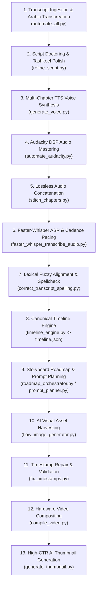

# GEMINI.md — YouTube Al-Daheeh Automation Pipeline

Operating instructions, architecture standards, standard commands, and coding conventions for the YouTube Al-Daheeh Automation Pipeline.

---

## 1. Project Overview & Architecture

The **YouTube Al-Daheeh Automation Pipeline** (`v4.0.0`) is a production-grade, automated video generation pipeline designed for Windows. It transcreates input YouTube transcripts into Egyptian/Khaleeji Arabic cultural scripts (emulating the "Al-Daheeh" educational persona), generates multi-chapter neural voiceovers, applies Audacity DSP audio mastering, aligns speech using Faster-Whisper ASR, orchestrates Gemini storyboard roadmaps and prompt planning via Chrome DevTools Protocol (CDP), synthesizes visual assets via Google Flow, and renders high-definition videos with FFmpeg hardware acceleration (Intel QSV / NVIDIA NVENC).

### Core Pipeline Phases (Execution DAG)



- **Supervisor Orchestrator**: [run_agency.py](file:///C:/Users/Snoozer/Downloads/Antigravity/Youtube%20Automation%202/buckup/Version%204%20before%20deepseek%20implementation%20plan/image_generation/run_agency.py) drives batch processing across `youtube_runs/<Title>/` using a persistent state machine recorded in `pipeline.json`.
- **Zero Cloud SDK Policy**: Never add `google-generativeai`, `openai`, or `anthropic` SDK packages. All cloud model interactions occur via Playwright CDP (`127.0.0.1:9222`) driving web browser sessions (Google Gemini, Google AI Studio, Google Flow).

---

## 2. Tech Stack & Environment

| Component | Technology | Details & Constraints |
| :--- | :--- | :--- |
| **Language** | Python 3.10+ | Setuptools packaging (`pyproject.toml:11`), Windows 11 target. |
| **Browser CDP** | Playwright `>=1.40.0` | Direct CDP session control on `127.0.0.1:9222` (Chrome / Opera GX). |
| **ASR & Speech** | Faster-Whisper, OpenAI-Whisper, PyTorch | CTranslate2 GPU/CPU with VAD pause splitting, word-level timestamps. |
| **Audio DSP** | Audacity 3.x (`mod-script-pipe`) | IPC communication over Windows Named Pipes (`\\.\pipe\ToSrvPipe`, `\\.\pipe\FromSrvPipe`). |
| **Video Compositing** | FFmpeg 5.0+ / FFprobe | Hardware encoding: Intel QSV (`h264_qsv`) → NVENC (`h264_nvenc`) → CPU (`libx264`). |
| **Data & Validation** | Pydantic `>=2.0.0`, python-docx | Strict schema contracts for storyboards, atomic JSON state management. |
| **Lint / Format / Types** | Ruff `>=0.4.0`, Black `>=24.0.0`, Mypy `>=1.9.0` | 100-character line length, strict typing (`mypy --strict --ignore-missing-imports`). |
| **Testing** | Pytest `>=8.0.0`, Pytest-Cov, Pytest-Mock | Unit suite (`tests/unit`) and end-to-end integration tests (`tests/integration`). |

---

## 3. Repository Directory Layout

```
image_generation/
├── automate_all.py                  # Phase 1: Ingestion & Arabic transcreation
├── refine_script.py                 # Phase 2: Script doctoring & Tashkeel polish
├── generate_voice.py                # Phase 3: AI Studio multi-chapter TTS synthesis
├── automate_audacity.py             # Phase 4: Audacity Named Pipe DSP mastering
├── stitch_chapters.py               # Phase 5: Lossless WAV audio concatenation
├── faster_whisper_transcribe_audio.py # Phase 6: Whisper ASR with VAD pause splitting
├── correct_transcript_spelling.py   # Phase 7: Fuzzy transcript alignment & spellcheck
├── timeline_engine.py               # Phase 8: Canonical timeline engine (timeline.json)
├── roadmap_orchestrator.py          # Phase 9a: Storyboard roadmap paging (25-row pages)
├── prompt_planner.py                # Phase 9b: Ephemeral JSON visual prompt planning
├── flow_image_generator.py          # Phase 10: Google Flow browser asset generator
├── fix_timestamps.py                # Phase 11: Timestamp repair & visual alignment
├── compile_video.py                 # Phase 12: FFmpeg hardware video compositing
├── generate_thumbnail.py            # Phase 13: High-CTR thumbnail generator
├── run_agency.py                    # Batch supervisor & pipeline state machine
│
├── gemini_controller.py             # Planning layer: CDP injection ladder & turn handshake
├── gemini_utils.py                  # Low-level Gemini DOM selectors & stability polling
├── pipeline_manifest.py             # Hash-gated caching & execution manifests
├── json_sanitizer.py                # LLM JSON parsing, repair, and normalization
├── validator.py                     # Visual prompt integrity, Arabic retention & rules
├── utils.py                         # Atomic file I/O, process management & config rotation
│
├── video_config.txt                 # FFmpeg video, encoder, audio loudnorm & zoom settings
├── transcribe_config.txt            # Whisper ASR model, VAD, cadence & word chunk limits
├── daheeh_config.json               # Persona lexicon, 30/70 Fusha/Amiya ratio & Tashkeel
├── pyproject.toml                   # Build system, tool configurations (black, ruff, mypy, pytest)
├── pytest.ini                       # Pytest test discovery & marker configurations
├── requirements.txt                 # Runtime dependencies
├── requirements-dev.txt             # Development, testing, and linting dependencies
│
├── tests/
│   ├── conftest.py                  # Pytest fixtures & root path configuration
│   ├── unit/                        # Unit tests (mocked external dependencies)
│   ├── integration/                 # Integration tests (requires FFmpeg/CDP)
│   └── mocks/                       # Mock data fixtures and payloads
│
├── docs/                            # Architectural documentation, ADRs, and session ledgers
│   ├── adr/                         # Architecture Decision Records (ADR 0001 - 0005)
│   ├── short-term-plan/CONTINUITY.md # Continuity ledger (session state)
│   └── error-solving/understood-errors.md # Documented error patterns & failure modes
│
└── youtube_runs/                    # [GITIGNORED] Output directory for video projects
```

---

## 4. Standard Commands

All commands should be executed from the repository root using Windows PowerShell.

### Environment Setup

```powershell
# 1. Create and activate virtual environment
python -m venv venv
.\venv\Scripts\Activate.ps1

# 2. Install runtime and development dependencies
pip install -r requirements.txt
pip install -r requirements-dev.txt

# 3. Install browser binaries for Playwright
python -m playwright install --with-deps

# 4. Copy environment configuration
copy .env.example .env
```

### Testing & Verification

```powershell
# Run CI unit tests (fast, no external dependencies required)
python -m pytest tests/unit -v

# Run full test suite (including integration tests requiring FFmpeg lavfi)
python -m pytest tests/ -v

# Run a single test file
python -m pytest tests/unit/test_timeline_engine.py -v

# Run test coverage with missing line reports
python -m pytest tests/ --cov=. --cov-report=term-missing
```

> [!IMPORTANT]
> Always invoke pytest via `python -m pytest ...` from the workspace root to ensure `sys.path` correctly includes the root modules.

### Formatting, Linting & Type Checking

```powershell
# Lint and auto-fix with Ruff
ruff check . --fix

# Verify code formatting with Ruff & Black
ruff format --check .
black --check --line-length 100 .

# Static Type Checking (strict mode)
mypy .

# Run all configured pre-commit hooks
pre-commit run --all-files
```

### Pipeline Execution

```powershell
# Run the automated batch supervisor across all pending projects
python run_agency.py

# Or execute specific stages individually:
python automate_all.py
python refine_script.py
python generate_voice.py
python automate_audacity.py
python stitch_chapters.py
python faster_whisper_transcribe_audio.py
python correct_transcript_spelling.py
python flow_image_generator.py
python fix_timestamps.py
python compile_video.py
python generate_thumbnail.py
```

---

## 5. Coding Conventions & Critical System Invariants

### 1. Architecture & Layering Rules
- **Strict Planning Layer DAG**: Dependencies must flow unidirectionally downwards:
  `flow_image_generator.py` → `pipeline_manifest.py` → `json_sanitizer.py` → `validator.py` → `gemini_controller.py` → `roadmap_orchestrator.py` → `prompt_planner.py`.
  *Never introduce upward imports.* Pure text manipulation utilities belong in `validator.py` or `utils.py`.
- **Canonical Timeline Single Source of Truth**: [timeline_engine.py](file:///C:/Users/Snoozer/Downloads/Antigravity/Youtube%20Automation%202/buckup/Version%204%20before%20deepseek%20implementation%20plan/image_generation/timeline_engine.py) manages `timeline.json`. All video compositing and timestamp alignment must consume `timeline.json` or its backward-compatible sidecars (`.sha256`). Deprecated configuration keys (`IMAGE_PAUSE_SPLIT`, `SILENCE_SPLIT_GAP`) must alias cleanly to `VAD_SNAP_THRESHOLD` with a one-time migration warning.

### 2. Windows & Subprocess Safety
- **Safe Subprocess Execution**: Always pass command arguments as a `list` with `shell=False`.
- **UTF-8 Encoding Enforcement**: All file I/O must specify `encoding="utf-8"` with `ensure_ascii=False` for JSON. Windows console streams must be forced to UTF-8:
  ```python
  import sys
  if sys.platform == "win32":
      sys.stdout.reconfigure(encoding="utf-8")
  ```

### 3. Atomic State & Checkpoint Persistence
- **Atomic Disk Writes**: Never write directly to configuration or checkpoint files. Use `NamedTemporaryFile` + `os.replace` + `fsync` (see `utils.update_config_value` and `utils.write_json_atomic`).
- **Idempotent Checkpoints**: Never destructively overwrite `pipeline.json`, `*_checkpoint.json`, `master_roadmap.jsonl`, or `voice_generation_manifest.json`. State modifications must support resumption from interruptions.

### 4. Intel QSV & FFmpeg Compositing Invariants
- **QSV Lookahead Starvation**: Always set `QSV_LOOKAHEAD=0` for Intel QuickSync (`h264_qsv`). Setting lookahead with software-decoded frames exhausts hardware frame pools and causes silent bitstream corruption.
- **Pixel Format Conversion**: Always append `format=nv12` to filtergraphs for Intel QSV hardware encoding; output `yuv420p` for player compatibility.
- **FFmpeg 32KB Windows CLI Limit**: Complex filtergraphs exceeding 1,000 characters must be written to disk (`temp_clips/filter_chunk_*.txt`) and passed via `-filter_complex_script`.
- **Zero-Drift Frame Arithmetic**: Pin all clip durations using integer frames: `frame_count = round(duration * fps)`. Force clip 0 to start at frame 0 and enforce CFR (`fps_mode cfr`).

### 5. Playwright CDP & Gemini Automation
- **Host Binding**: Always connect Playwright CDP to `127.0.0.1:9222` (never `localhost` to avoid Windows IPv6 resolution latency/failure).
- **Process Management**: Kill stale browser processes by port PID (`utils.kill_cdp_chrome`), never via global `taskkill /IM chrome.exe`.
- **Prompt Injection Ladder**: Prompts must use the injection ladder in `gemini_controller.inject_prompt_via_cdp` (`insert_text` → Clipboard Ctrl+V → `execCommand` → `fill()` only for payloads <500 chars) with a mandatory ≥95% `inner_text()` readback check before clicking submit.
- **Turn Completion Handshake**: Use `wait_for_gemini_turn_completion`: stop button absent + 3× stability checks at 500ms intervals (hard gates). Action-bar visibility is a soft gate.
- **Fixed-Size Roadmap Paging**: Roadmap generation must use fixed 25-line window pages (`ROADMAP_WINDOW_SIZE=25`). Never tail-merge leftover rows into large pages (>50 rows triggers LLM truncation).

---

## 6. Subagent Task Reference Matrix

| Phase / Task | Primary Script | Key Verification Checklist |
| :--- | :--- | :--- |
| **Linguistic Transcreation** | `automate_all.py` | 30/70 Fusha/Amiya ratio; academic fallback on safety blocks. |
| **Script Polish** | `refine_script.py` | Tashkeel vocalization; strip `<thinking>` and `<slang_ledger>` tags. |
| **Voice Synthesis** | `generate_voice.py` | Bezier mouse curves; MD5 hash dedup across chapters; proactive reload at 40 chapters. |
| **DSP Mastering** | `automate_audacity.py` | Named Pipes connection verified; `SelectAll:` before applying macro effects. |
| **Audio Concatenation** | `stitch_chapters.py` | Lossless WAV frame concatenation; 0 dropped frames. |
| **ASR & Cadence Alignment** | `faster_whisper_transcribe_audio.py` | 3–6 words/chunk; VAD split at 0.35s–0.40s; `transcribe_config.txt` sync. |
| **Fuzzy Spellcheck** | `correct_transcript_spelling.py` | `difflib.SequenceMatcher` against `refined_script.txt`; timestamps locked. |
| **Timeline Engine** | `timeline_engine.py` | Validates `timeline.json` schema, monotonic word indexing, contiguous spans. |
| **Roadmap Paging** | `roadmap_orchestrator.py` | Fixed 25-row pages; anchor = exact last row of page K-1; atomic JSONL updates. |
| **Prompt Planning** | `prompt_planner.py` | ±1 buffer row context; single-turn ephemeral sessions; self-heal ≤2 turns. |
| **Image Generation** | `flow_image_generator.py` | `@asset` chip injections; de-hovered screenshot capture; PIL file verification. |
| **Video Compositing** | `compile_video.py` | Zero-drift frame math; `filter_complex_script`; QSV → NVENC → CPU fallback. |
| **Thumbnail Creation** | `generate_thumbnail.py` | Dual-variant generation; self-critique CTR evaluation scoring. |

---

## 7. Operational Guidelines for Coding Agents

1. **Continuous Ledger Maintenance**: Update `docs/short-term-plan/CONTINUITY.md` when goals, state, or decisions change.
2. **Pre-flight Error Prevention**: Always review `docs/error-solving/understood-errors.md` before modifying video compositing, CDP injection, or DSP mastering code.
3. **Verification Before Completion**: Run `python -m pytest tests/unit -v` and `ruff check .` to verify changes before marking tasks complete.
4. **Surgical Diffing**: Touch only the files directly related to the active task. Do not modify gitignored output directories or unrelated test suites.
