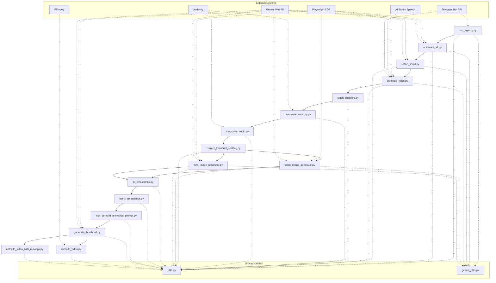

# YouTube Video Automation Pipeline

> **Automated end-to-end pipeline:** Copy YouTube Video 100% Authenticity. YouTube transcript → Khaleeji Arabic translation (Any Language) → Refinement and Enhancement Script → TTS voice generation → Audacity audio polish → AI image generation (Gemini/Google Flow) → Final video compilation (FFmpeg/MoviePy).

**Stack:** Python 3.10+ (Windows), Playwright CDP, Gemini Web UI, AI Studio Speech, FFmpeg, MoviePy 2.x, Audacity (named pipes + PyAutoGUI).

---

## Table of Contents

- [Quick Start](#quick-start)
- [Pipeline Overview](#pipeline-overview)
- [Configuration](#configuration)
- [Output Structure](#output-structure)
- [Architecture Overview](#architecture-overview)
- [Development](#development)
- [Troubleshooting](#troubleshooting)
- [Security](#security)
- [Contributing](#contributing)
- [Code of Conduct](#code-of-conduct)
- [License](#license)
- [Further Reading](#further-reading)

---

## Quick Start

### Prerequisites (One-Time Setup)

1. **Browser Profiles** — Open Chrome/Opera, sign into **both**:
   - `https://gemini.google.com`
   - `https://aistudio.google.com`
   - Create 3 profiles (used for account rotation)

2. **Audacity** — Enable `mod-script-pipe`: Tools → Modules → check `mod-script-pipe`

3. **Audacity Macro** — Create macro named exactly: `Macro_Achird Gemini Voice cut and enhance`

4. **Configuration** — Create `gemini_model.txt` from template below and fill in:

```ini
# Configuration for Gemini Web App Models & Accounts
VOICE_GENERATOR_MODEL=Flash-Lite
IMAGE_PLANNER_MODEL=Pro
IMAGE_RESET_LOOP_LIMIT=20
SWITCH_ACCOUNTS_ENABLED=true
ACTIVE_PROFILE_INDEX=1
FAILOVER_RETRY_LIMIT=3
BROWSER_TYPE=opera
FLOW_IMAGE_MODEL=Nano Banana Pro
FLOW_IMAGE_COUNT=1x
IMAGE_GENERATOR_TYPE=flow
SCRIPT_BREAKER_MODEL=Flash
SCRIPT_TRANSLATOR_MODEL=Pro
TELEGRAM_BOT_TOKEN=
TELEGRAM_CHAT_ID=
REFINE_MODEL=Pro
THUMBNAIL_MODEL=Nano Banana Pro
```

**Required values:** `TELEGRAM_BOT_TOKEN`, `TELEGRAM_CHAT_ID` (for notifications), `ACTIVE_PROFILE_INDEX` (1–3), `IMAGE_GENERATOR_TYPE` (`flow` or `script`).

### Run Full Pipeline

```bash
python run_agency.py
```

Runs all 9 steps with checkpoint/resume at each stage.

### Run Single Step (Idempotent — Safe to Rerun)

```bash
python automate_all.py                 # Step 1: transcript → translate
python refine_script.py                # Step 1b: refine Arabic script
python generate_voice.py               # Step 2: TTS generation
python stitch_chapters.py              # Step 3: merge chapter WAVs
python automate_audacity.py            # Step 4: Audacity PyAutoGUI polish
python transcribe_audio.py             # Step 5: Audacity named pipes + transcription
python correct_transcript_spelling.py  # Step 6: fix ASR spelling
python script_image_generator.py       # Step 7a: Gemini UI images
python flow_image_generator.py         # Step 7b: Google Flow images
python generate_thumbnail.py           # Step 7c: thumbnail variants
python fix_timestamps.py               # Step 8: inject timestamps
python compile_video.py                # Step 9a: FFmpeg (Ken Burns)
python compile_video_with_moviepy.py   # Step 9b: MoviePy (SRT timeline)
```

> **All scripts are idempotent** — they read/write JSON checkpoints in `youtube_runs/<Title>/`. Safe to kill and rerun anytime.

### Clean Room Reset

```bash
rm -rf youtube_runs/"<Video Title>"
python run_agency.py
```

---

## Pipeline Overview

| # | Script | Input | Output | Key Config |
|---|--------|-------|--------|------------|
| 1 | `automate_all.py` | YouTube URL (prompted) | `raw_transcript.txt` → `breaked_paragraphs.txt` → `final_output.txt` (Khaleeji Arabic) | `prompt.txt`, `prompt_phase3.txt`, `gemini_model.txt` |
| 1b | `refine_script.py` | `final_output.txt` | `refined_script.txt`, `refined_script.docx` | `refine_prompt.txt`, `REFINE_MODEL` |
| 2 | `generate_voice.py` | `refined_script.txt` | `Chapter_*.wav` | `TTS_PROMPT.txt`, `VOICE_GENERATOR_MODEL` |
| 3 | `stitch_chapters.py` | `Chapter_*.wav` | `full_episode_voice.wav` | — |
| 4 | `automate_audacity.py` | `full_episode_voice.wav` | `audacity_voice/full_episode_voice.wav` | Macro on Ctrl+Shift+O |
| 5 | `transcribe_audio.py` | `Chapter_*.wav` | `timestamped_transcript.txt`, `.srt`, `image_timestamps.txt` | Named pipes, per-chapter macro |
| 6 | `correct_transcript_spelling.py` | `timestamped_transcript.txt` + `final_output.txt` | Corrected timestamped transcript | SequenceMatcher alignment |
| 7a | `script_image_generator.py` | `refined_script.txt` | `pre_planned_prompts.txt` → `generated_images/*.png` | `IMAGE_PLANNER_MODEL`, `visuals_plan.txt` |
| 7b | `flow_image_generator.py` | `refined_script.txt` | `flow_prompts.json` → `generated_images/*.png` | `FLOW_IMAGE_MODEL`, `FLOW_IMAGE_COUNT` |
| 7c | `generate_thumbnail.py` | `refined_script.txt` | `thumbnails/variant_*.png` | `THUMBNAIL_MODEL`, Nano Banana Pro prompts |
| 8 | `fix_timestamps.py` | `timestamped_transcript.txt` + `flow_prompts.json` | Updated `flow_prompts.json` with timestamps | Auto-skips if timestamps present |
| 9a | `compile_video.py` | `flow_prompts.json` + images | `youtube_ready_video.mp4` (Ken Burns) | `ENABLE_ANIMATIONS`, `manual_animations.txt` |
| 9b | `compile_video_with_moviepy.py` | `.srt` + images | `youtube_ready_video.mp4` (static) | `ENABLE_SUBTITLES`, MoviePy 2.x API |

**Choose image generator:** `IMAGE_GENERATOR_TYPE=flow` (reliable, slower) or `=script` (faster, fragile) in `gemini_model.txt`.

**Choose video compiler:** Set in `run_agency.py` pipeline config (FFmpeg for animations, MoviePy for subtitle sync).

---

## Configuration

All config files live in **project root**. Per-run overrides go in `youtube_runs/<Title>/`.

| File | Purpose | Key Values |
|------|---------|------------|
| `gemini_model.txt` | **Main config** — models, rotation, browser, Telegram, generator selection | `VOICE_GENERATOR_MODEL`, `IMAGE_PLANNER_MODEL`, `FLOW_IMAGE_MODEL`, `IMAGE_GENERATOR_TYPE`, `ACTIVE_PROFILE_INDEX`, `SWITCH_ACCOUNTS_ENABLED`, `TELEGRAM_BOT_TOKEN`, `TELEGRAM_CHAT_ID`, `BROWSER_TYPE` (chrome/opera), `REFINE_MODEL`, `THUMBNAIL_MODEL` |
| `video_config.txt` | Video compile toggles | `ENABLE_ANIMATIONS=true/false`, `ENABLE_SUBTITLES=true/false` |
| `voice_option_notes.txt` | TTS reference (model, temp, voice, whisper) | Read-only reference |
| `prompt.txt` | Phase 1: paragraph breaking rules | |
| `prompt_phase3.txt` | Phase 3: Khaleeji White Dialect translation style | |
| `refine_prompt.txt` | Script refinement: fluency, dialect, hook, outro (2-turn) | |
| `TTS_PROMPT.txt` | Voice prosody architecture guidelines | |
| `visual_style.txt` | Visual style rules (per-run override in `youtube_runs/<Title>/`) | |
| `visuals_plan.txt` | Storyboard blueprint (per-run override in `youtube_runs/<Title>/`) | |

> ⚠️ **`gemini_model.txt` contains Telegram credentials — never commit.** Already in `.gitignore`.

---

## Output Structure

```
youtube_runs/<Video Title>/
├── raw_transcript.txt              # Raw YouTube transcript
├── breaked_paragraphs.txt          # Gemini-parsed paragraphs
├── final_output.txt                # Translated Khaleeji Arabic
├── refined_script.txt              # Polished Arabic script
├── refined_script.docx             # Word document copy
├── timestamped_transcript.txt      # Whisper lines [MM:SS]
├── timestamped_transcript.srt      # SRT subtitles
├── image_timestamps.txt            # Alias for image timing
├── full_episode_voice.wav          # Stitched TTS audio
├── audacity_voice/
│   └── full_episode_voice.wav      # PyAutoGUI Audacity output
├── Chapter_*.wav                   # Per-chapter TTS files
├── pre_planned_prompts.txt         # Storyboard (Gemini path)
├── flow_prompts.json               # JSON storyboard (Flow path)
├── generated_images/               # PNG images per timestamp
│   └── *.png
├── generated_images_duplicates/    # Extra copies from multi-gen
├── thumbnails/
│   └── variant_*.png               # Thumbnail variants
├── temp_clips/                     # Per-frame FFmpeg clips
├── concat.txt                      # FFmpeg concat list
├── youtube_ready_video.mp4         # **Final output**
├── flow_workspace_url.txt          # Google Flow resume URL
├── pipeline.json                   # run_agency.py batch state
└── *.json                          # Checkpoint files (auto-resume)
```

---

## Architecture Overview



### All AI is Browser Automation

- Playwright CDP → manually-signed-in Chrome/Opera on port 9222
- **No API keys** — everything via `gemini.google.com` and `aistudio.google.com`
- Shared utilities: `utils.py` (browser launch/cleanup, config, Telegram), `gemini_utils.py` (Gemini UI helpers)
- Account rotation: `ACTIVE_PROFILE_INDEX` cycles Chrome profiles 1→3 via `rotate_profile_index()`

### Dual Audacity Paths (Different Mechanisms)

| Script | Mechanism | Scope |
|--------|-----------|-------|
| `automate_audacity.py` | PyAutoGUI keystrokes (Ctrl+A → Ctrl+Shift+O) | Full episode |
| `transcribe_audio.py` | Named pipes (`\\.\pipe\ToSrvPipe`) | Per chapter |

Both required. PyAutoGUI needs macro on Ctrl+Shift+O. Named pipes needs `mod-script-pipe` + macro registered by exact name.

### Checkpoint/Resume Everywhere

Every long-running script saves progress to JSON in `youtube_runs/<Title>/`. Safe to Ctrl+C and rerun. Checkpoints auto-delete on success.

### Dual Image Generation

- **`script_image_generator.py`** → Gemini Web UI direct (Playwright hover+download). Input: `pre_planned_prompts.txt`. Faster, fragile.
- **`flow_image_generator.py`** → Google Flow (JS base64 extraction). Input: `flow_prompts.json`. Slower, reliable. Saves workspace URL for resume.

### Dual Video Compilation

- **`compile_video.py`** (FFmpeg) — Ken Burns camera moves per frame (zoom/pan/static). Reads `flow_prompts.json`. Supports `manual_animations.txt` overrides.
- **`compile_video_with_moviepy.py`** (MoviePy 2.x) — SRT-driven timeline, static images. Uses `.with_start()`/`.with_duration()`.

### Windows-Only Constraints

- Hardcoded paths: Chrome, Opera, Audacity, debug profiles
- `ctypes.windll` for native clipboard (TTS script)
- `sys.stdout.reconfigure(encoding='utf-8')` for Arabic
- `CREATE_NEW_CONSOLE | DETACHED_PROCESS` for browser launch

---

## Development

### Debugging

- **Browser Inspection:** Attach to `localhost:9222` via Chrome DevTools (no VS Code config needed)
- **Logs:** All scripts emit emoji-prefixed stdout: `✅` success, `⏭️` skip, `❌` error, `🔄` retry
- **Browser Inspection:** Attach to CDP port 9222 to inspect DOM during Gemini interactions

### Project Structure

```
├── run_agency.py              # Main orchestrator (use this)
├── run.bat                    # Legacy (avoid)
├── automate_all.py            # Step 1: transcript → translate
├── refine_script.py           # Step 1b: refine Arabic
├── generate_voice.py          # Step 2: TTS
├── stitch_chapters.py         # Step 3: merge WAVs
├── automate_audacity.py       # Step 4: PyAutoGUI Audacity
├── transcribe_audio.py        # Step 5: Named pipes Audacity
├── correct_transcript_spelling.py  # Step 6: spelling fix
├── script_image_generator.py  # Step 7a: Gemini UI images
├── flow_image_generator.py    # Step 7b: Google Flow images
├── generate_thumbnail.py      # Step 7c: thumbnails
├── fix_timestamps.py          # Step 8: timestamp injection
├── compile_video.py           # Step 9a: FFmpeg (Ken Burns)
├── compile_video_with_moviepy.py  # Step 9b: MoviePy (SRT)
├── utils.py                   # Shared: browser, config, Telegram, profiles
├── gemini_utils.py            # Shared: Gemini UI helpers
├── gemini_model.txt           # Main config (gitignored)
├── video_config.txt           # Video toggles
├── voice_option_notes.txt     # TTS reference
├── prompt.txt                 # Phase 1 prompt
├── prompt_phase3.txt          # Phase 3 prompt
├── refine_prompt.txt          # Refinement prompt
├── TTS_PROMPT.txt             # TTS prosody prompt
├── visual_style.txt           # Visual style rules
├── visuals_plan.txt           # Storyboard blueprint
├── youtube_runs/              # Runtime output (per video)
├── legacy_and_utilities/      # Old scripts (reference only)
├── Implementation plans/      # Future feature specs
└── .opencode/agent/AGENTS.md  # OpenCode agent config (mirror)
```

---

## Troubleshooting

| # | Symptom | Cause | Fix |
|---|---------|-------|-----|
| 1 | "Input box not found" | Browser not signed into **both** Gemini and AI Studio | Sign into both before running |
| 2 | Gemini response timeout | Google UI changed `model-response div.markdown` | Update `RESPONSE_SELECTOR` in `gemini_utils.py` |
| 3 | Audacity macro not found | `mod-script-pipe` disabled or macro name mismatch | Enable module; verify exact name `Macro_Achird Gemini Voice cut and enhance` |
| 4 | `generate_voice.py` hangs 300s | 250MB context limit on `wait_for_selector` | Restart browser profile; check `FAILOVER_RETRY_LIMIT` |
| 5 | Arabic JSON garbled | Missing `ensure_ascii=False` | Already handled in all scripts |
| 6 | Used `run.bat` by mistake | Legacy 5-step only (no audacity/stitch/spellcheck/fixtimes) | Always use `python run_agency.py` |
| 7 | Profile index error | `ACTIVE_PROFILE_INDEX` > 3 | Reset to 1 in `gemini_model.txt` |
| 8 | FFmpeg concat fails | `temp_clips/` empty or naming mismatch | Check `flow_prompts.json` frame entries |
| 9 | MoviePy import error | MoviePy 1.x vs 2.x API | Requires MoviePy 2.x (`.with_start()`, `.with_duration()`) |
| 10 | Flow workspace stale | Google Flow session expired | Delete `flow_workspace_url.txt` to force new session |
| 11 | Thumbnail generation fails | Nano Banana Pro prompt format changed | Check `generate_thumbnail.py` template |
| 12 | PyAutoGUI clicks wrong window | Multiple Audacity instances / focus lost | Ensure single Audacity instance; check focus logic |
| 13 | Named pipe connection refused | Audacity not running or `mod-script-pipe` off | Start Audacity manually; verify Tools → Modules |

---

## Security

- **`gemini_model.txt` contains Telegram bot token** — **never commit**. In `.gitignore`.
- No API keys stored anywhere — all AI via browser automation.
- Account rotation cycles `ACTIVE_PROFILE_INDEX` across 3 pre-logged-in Chrome profiles.
- Native Windows clipboard via `ctypes` (TTS script only).

---

## Contributing

Contributions are welcome! Please read our [Contributing Guide](CONTRIBUTING.md) for details on:

- How to report bugs and request features
- Code style and commit conventions
- Pull request process
- Development environment setup
- Testing guidelines

### Quick Contribution Checklist

- [ ] Fork the repository
- [ ] Create a feature branch (`git checkout -b feature/amazing-feature`)
- [ ] Make your changes with clear, descriptive commits
- [ ] Run the full pipeline locally to verify nothing breaks
- [ ] Update documentation if you change behavior
- [ ] Open a Pull Request with a clear description

---

## Code of Conduct

This project follows the [Contributor Covenant Code of Conduct](CODE_OF_CONDUCT.md). By participating, you agree to uphold this code. Please report unacceptable behavior to the project maintainers.

---

## License

This project is licensed under the MIT License — see the [LICENSE](LICENSE) file for details.

---

## Further Reading

- **Developer Workflow:** [Project-workflow.md](Project-workflow.md) — ADRs, detailed architecture, debugging, legacy reference
- **Implementation Plans:** `Implementation plans/` — upcoming features
- **Legacy Scripts:** `legacy_and_utilities/` — historical reference only

---

*Built with ❤️ for Arabic content automation on YouTube*
