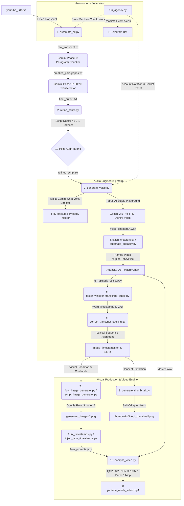

# 🎬 Autonomous YouTube Video Production Pipeline

### *Autonomous, broadcast-grade educational YouTube studio producing high-retention explainer videos — zero cloud bills, zero API keys.*

An enterprise-grade, fully autonomous multimedia pipeline that transforms a single YouTube URL into a complete, broadcast-ready educational documentary: conversational script transcreation across adaptive channel niches, studio-grade TTS with multi-account failover, Win32 Named Pipe DSP mastering, word-level subtitle sync, Google Flow continuity visuals, and hardware-accelerated video compositing with procedural Ken Burns kinematics.

[](https://www.python.org/)
[](https://playwright.dev/)
[](https://github.com/SYSTRAN/faster-whisper)
[](https://www.audacityteam.org/)
[](https://ffmpeg.org/)
[](https://labs.google/fx/tools/flow)
[](https://aistudio.google.com/)
[](https://telegram.org/)
[](LICENSE)

---

## Adaptive multi-channel production (opt-in)

The new staged workflow analyzes raw scripts against an explicitly selected channel before translation, then plans narration-aligned stills and selective local overlays. It requires preview review before activating a master. See the [usage guide](tasks/adaptive-visual-usage.md), [architecture plan](tasks/adaptive-visual-plan.md), and [implementation checklist](tasks/adaptive-visual-tasks.md) for supported commands and remaining live-validation gates.

## Table of Contents

- [🤔 What Is This Pipeline?](#-what-is-this-pipeline)
- [⭐ Core Architectural Philosophy](#-core-architectural-philosophy)
- [🗺️ Master Pipeline Flow](#-master-pipeline-flow)
- [⚡ Get Started](#-get-started)
- [🛠️ Pipeline Reference](#-pipeline-reference)
- [🎛️ Configuration](#-configuration)
- [🏃 Granular CLI & Modular Execution](#-granular-cli--modular-execution)
- [📂 Output File Hierarchy](#-output-file-hierarchy)
- [🩺 Diagnostics & Troubleshooting](#-diagnostics--troubleshooting)
- [🔒 Security & Safe Automation](#-security--safe-automation)
- [📄 License](#-license)

---

## 🤔 What Is This Pipeline?

Traditional AI media pipelines depend on fragile, costly API tiers — token quotas, paid SDKs, and restrictive safety filters that kill creative dialects. This pipeline **flips the script**: every AI interaction flows through Playwright CDP automation against the authenticated web apps you already use (Gemini Web, AI Studio Speech Playground, and Google Flow), so a full video costs nothing beyond your existing subscriptions.

Input is a single YouTube URL. Output is:

- **Adaptive conversational script** — natural dialect code-switching (30% academic precision : 70% engaging conversational phrasing), 1-3-1 Gary Provost cadence, rhythmic dead-air markers, and phonetic Tashkeel diacritics configured via the Dynamic Niche Engine.
- **Studio-mastered voice** — Gemini 2.5 Pro TTS chapters stitched losslessly, then DSP-processed in Audacity via Windows Named Pipes
- **Zero-drift subtitles** — Faster-Whisper word timestamps aligned against the script with `difflib.SequenceMatcher`, split into 3–6 word chunks for mobile reading
- **Continuity-chained visuals** — Google Flow frames driven by an Inverted Pyramid master roadmap with Two-Substrate Studio grounds (`#2A2420` Ahwa wood vs `#F8F8FA` neutral limbo)
- **A 1440p/1080p master video** — hardware-accelerated Ken Burns camera engine featuring AudioTransientDetector with +33.3ms optical lag compensation and EBU R128 dual-pass loudness normalization

---

## ⭐ Core Architectural Philosophy

1. **CDP Web-Browser Orchestration** — Connects natively over Chrome DevTools Protocol (`localhost:9222`) to automate authenticated sessions in Google Gemini Web App, Google AI Studio Speech Playground, and Google Flow.
2. **The Dynamic Multi-Niche Linguistic Engine** — Implements an adaptive conversational code-switching rule, dynamic channel profiles (`GENERAL_EXPLAINER`, `SCIENCE_TECH`, `FINANCE_ECONOMICS`, `HISTORY_GEOPOLITICS`, `PHILOSOPHY_ESSAY`, `CULTURE_COMEDY`), and phonetic Tashkeel for neural vocalization.
3. **Autonomous Named-Pipe DSP** — Controls Audacity via Windows IPC Named Pipes (`\\.\pipe\ToSrvPipe`) to apply multiband compression, noise gating, EQ curves, and silence truncation without manual GUI interaction.
4. **Zero-Drift ASR & Cadence Pacing** — Faster-Whisper with GPU/CPU fallbacks, voice-activity detection (VAD), and `difflib.SequenceMatcher` lexical alignment to match every spoken syllable with sub-second visual frame transitions.
5. **Multi-Frame Continuity Chaining** — Directs Google Flow with global master roadmaps, JSON keyframe matrices, top-of-feed $(y, x)$ card sorting, and DOM-level reference chip injection for frame-to-frame consistency.
6. **Hardware-Accelerated Compositing** — FFmpeg Ken Burns camera engine (Push-in, Pull-out, Pan, Tilt, Static, Scale Punch) with automatic failover across Intel QuickSync (`h264_qsv`), NVIDIA (`h264_nvenc`), and multi-threaded CPU (`libx264`) rendering with proxy ladder generation (1080p/720p).
7. **Stateful Checkpoint & Failover Engine** — Resumes instantly at the exact paragraph, voice chapter, or visual frame upon interruption, paired with multi-profile browser cycling and Telegram push notifications.

---

## 🗺️ Master Pipeline Flow


```mermaid
flowchart TD
    A[youtube_urls.txt] -->|Fetch Transcript| B(1. automate_all.py)
    B -->|raw_transcript.txt| B1(Gemini Phase 1: Paragraph Chunker)
    B1 -->|breaked_paragraphs.txt| B2(Gemini Phase 3: 30/70 Transcreator)
    B2 -->|final_output.txt| C(2. refine_script.py)
    C -->|Script Doctor / 1-3-1 Cadence| C1{10-Point Audit Rubric}
    C1 -->|refined_script.txt| D(3. generate_voice.py)

    subgraph Audio Engineering Matrix
        D -->|Tab 1: Gemini Chat Voice Director| D1[TTS Markup & Prosody Injector]
        D -->|Tab 2: AI Studio Playground| D2[Gemini 2.5 Pro TTS - Achird Voice]
        D2 -->|voice_chapters/*.wav| E(4. stitch_chapters.py / automate_audacity.py)
        E -->|Named Pipes \\.\pipe\ToSrvPipe| E1[Audacity DSP Macro Chain]
        E1 -->|full_episode_voice.wav| F(5. faster_whisper_transcribe_audio.py)
        F -->|Word Timestamps & VAD| F1(6. correct_transcript_spelling.py)
        F1 -->|Lexical Sequence Alignment| G[image_timestamps.txt & SRTs]
    end

    subgraph Visual Production & Video Engine
        G -->|Visual Roadmap & Continuity| H(7. flow_image_generator.py / script_image_generator.py)
        H -->|Google Flow / Imagen 3| H1[generated_images/*.png]
        G -->|Concept Extraction| I(8. generate_thumbnail.py)
        I -->|Self-Critique Matrix| I1[thumbnails/title_*_thumbnail.png]
        H1 --> J(9. fix_timestamps.py / inject_json_timestamps.py)
        J -->|flow_prompts.json| K(10. compile_video.py)
        E1 -->|Master WAV| K
        K -->|QSV / NVENC / CPU Ken Burns 1440p| L[🎬 youtube_ready_video.mp4]
    end

    subgraph Autonomous Supervisor
        M[run_agency.py] -.->|State Machine Checkpoints| B
        M -.->|Account Rotation & Socket Reset| D
        M -.->|Realtime Event Alerts| N[📲 Telegram Bot]
    end
```

---

## ⚡ Get Started

### 1. Repository setup

```bash
# Clone the repository
git clone https://github.com/YOUR-USERNAME/Youtube-Automation.git
cd Youtube-Automation

# Create and activate a virtual environment
python -m venv .venv
.venv\Scripts\activate

# Install production dependencies
pip install -r requirements.txt
```

### 2. Install external prerequisites

| Component | Requirement | Installation |
| :-------- | :---------- | :----------- |
| **FFmpeg & FFprobe** | Added to system `PATH` | `winget install Gyan.FFmpeg` |
| **Audacity 3.x+** | Installed to default location | **Edit** → **Preferences** → **Modules** → set `mod-script-pipe` to **Enabled** |
| **Chromium browsers** | Google Chrome and/or Opera / Opera GX | — |

### 3. Calibrate browser profiles

Launch Chrome in remote debugging mode on a dedicated profile so your daily browsing data stays untouched:

```powershell
"C:\Program Files\Google\Chrome\Application\chrome.exe" --remote-debugging-port=9222 --user-data-dir="C:\ChromeDebugProfile"
```

Then sign in to each service in the debug window:

- 🌐 [Google Gemini](https://gemini.google.com/app)
- 🌐 [Google AI Studio](https://aistudio.google.com/)
- 🌐 [Google Labs Flow](https://labs.google/fx/tools/flow)

Repeat for additional profiles if you want automated account rotation.

### 4. Configure the environment

Copy `.env.example` to `.env` and set your model routing, voice, and Telegram credentials (full reference in [Configuration](#-configuration)):

```ini
# --- LLM Engine Selection ---
VOICE_GENERATOR_MODEL=Flash-Lite
IMAGE_PLANNER_MODEL=Pro
SCRIPT_BREAKER_MODEL=Flash
SCRIPT_TRANSLATOR_MODEL=Pro
REFINE_MODEL=Pro
THUMBNAIL_MODEL=Nano Banana Pro

# --- Voice & Speech Studio ---
TTS_MODEL=gemini-2.5-pro-preview-tts
TTS_VOICE_NAME=Achird
TTS_TEMPERATURE=0.8
WHISPER_ENGINE=faster_whisper

# --- Visual Generation Matrix ---
IMAGE_GENERATOR_TYPE=flow
FLOW_IMAGE_MODEL=Nano Banana 2
FLOW_IMAGE_COUNT=1x
FLOW_DISABLE_AGENT=true
FLOW_CHUNK_SIZE=15
IMAGE_RESET_LOOP_LIMIT=20

# --- Failover & Account Rotation ---
SWITCH_ACCOUNTS_ENABLED=true
ACTIVE_PROFILE_INDEX=1
FAILOVER_RETRY_LIMIT=3
CDP_PORT=9222
BROWSER_TYPE=chrome

# --- Pipeline Feature Flags ---
ENABLE_REFINE_SCRIPT=true
FLIP_AUDACITY_ORDER=false
TELEGRAM_NOTIFY_PER_STEP=true
TELEGRAM_BOT_TOKEN=123456789:ABCdefGhIJKlmNoPQRsTUVwxyZ
TELEGRAM_CHAT_ID=987654321
```

### 5. Add source URLs

Populate `youtube_urls.txt` with one link per line:

```text
https://www.youtube.com/watch?v=WhvdzT6YvP8
```

### 6. Launch the pipeline

```bash
python run_agency.py
```

The supervisor state machine drives all eleven stages, rotates browser profiles on failure, and pushes live progress to Telegram.

---

## 🛠️ Pipeline Reference

### Canonical 10-Phase Pipeline Breakdown

| Phase | Script / Entrypoint | Primary Function | Input File(s) | Generated Asset(s) | Checkpoint / State |
| :---- | :------------------ | :--------------- | :------------ | :----------------- | :----------------- |
| **01** | `automate_all.py` | Captions ingestion & conversational transcreation across adaptive channel niches. Enforces $\ge 35\%$ script ratio gate. | `youtube_urls.txt`, `prompt.txt`, `prompt_phase3.txt` | `raw_transcript.txt`, `breaked_paragraphs.txt`, `final_output.txt`, `.docx` | `checkpoint.json` |
| **02** | `refine_script.py` | Injects 1-3-1 sentence cadence, comedic timing, niche-specific hooks, and phonetic Tashkeel diacritics. | `final_output.txt`, `refine_prompt.txt`, `daheeh_config.json` | `refined_script.txt`, `refined_script.docx`, `tts_payload.json` | `refine_checkpoint.json` |
| **03** | `generate_voice.py` | AI Studio Speech Playground neural synthesis (`gemini-2.5-pro-preview-tts`) with automated HTTP 403 multi-account failover. | `refined_script.txt`, `tts_payload.json` | `voice_chapters/Chapter_*.wav` | `voice_generation_manifest.json` |
| **04** | `automate_audacity.py` | Win32 Named Pipes DSP: 5-step broadcast chain (EQ curve, compression, noise gating, silence truncation, EBU R128). | `voice_chapters/Chapter_*.wav` | `polished_chapters/Chapter_*.wav` | `audio_manifest.json` |
| **05** | `stitch_chapters.py` | Losslessly concatenates chapter WAV tracks into a unified master audio file with strict format homogeneity assertions ($\Delta = 0.000\text{s}$). | `polished_chapters/Chapter_*.wav` | `full_episode_voice.wav` | Direct sample count verification |
| **06** | `faster_whisper_transcribe_audio.py` | Faster-Whisper ASR alignment with VAD pause snapping & sequence-matcher spelling correction, building immutable `timeline.json` SSOT. | `full_episode_voice.wav`, `refined_script.txt` | `timeline.json`, `timeline.json.sha256`, `timestamped_transcript.srt` | Cryptographic SHA-256 sidecar |
| **07** | `roadmap_orchestrator.py` & `flow_image_generator.py` | Paged 25-row storyboard planning and Google Flow visual synthesis featuring Universal 6-Part Prompt Grammar, Two-Substrate Studio grounds, and gap-skipping. | `timeline.json`, `refined_script.txt` | `master_roadmap.jsonl`, `flow_prompts.json`, `generated_images/*.png`, `studio_viewer.html` | `pipeline_manifest.json` |
| **08** | `fix_timestamps.py` | Synchronizes timeline anchors between transcript chunks and prompt schema while strictly enforcing read-only SSOT on `timeline.json`. | `generated_images/`, `flow_prompts.json` | Updated `flow_prompts.json`, `image_timestamps.txt.sha256` | Strict Read-Only SSOT |
| **09** | `compile_video.py` | Hardware-accelerated Ken Burns video compositor (Intel QSV / NVENC / CPU) featuring AudioTransientDetector with +33.3ms optical lag, discrete scale punches, and proxy ladders (1080p/720p). | `timeline.json`, `generated_images/*.png`, `full_episode_voice.wav` | 🎬 `youtube_ready_video.mp4`, 1080p & 720p proxies | `compile_checkpoint.json` |
| **10** | `generate_thumbnail.py` | High-CTR YouTube thumbnail packaging: 5 curiosity gap archetypes, 1-second mobile scan rule, and automated two-tier OCR text collision gate. | `titles.txt`, `refined_script.txt` | `thumbnails/title_*_thumbnail.png`, `thumbnail_critique.json` | `thumbnail_prompts.json` |

### Granular CLI & modular execution

Every step runs independently. Checkpoint files allow seamless restarts from the last successful operation:

```bash
# 1. Extract YouTube transcript and perform conversational transcreation
python automate_all.py

# 2. Refine script (1-3-1 cadence, humor/hooks, Tashkeel diacritics)
python refine_script.py

# 3. Synthesize chapter-by-chapter AI Studio voice tracks (with HTTP 403 failover)
python generate_voice.py

# 4. Apply DSP mastering chain in Audacity via Win32 Named Pipes
python automate_audacity.py

# 5. Losslessly stitch audio chapters into master track (exact 0.00s delta)
python stitch_chapters.py

# 6. Generate zero-drift canonical timeline.json via Faster-Whisper & spelling corrector
python faster_whisper_transcribe_audio.py

# 7. Plan storyboard roadmap and render visual frames via Google Flow
python roadmap_orchestrator.py
python flow_image_generator.py

# 8. Verify and inject timeline timestamps into prompt schema (Read-Only SSOT)
python fix_timestamps.py

# 9. Compile hardware-accelerated Ken Burns master video and proxy ladders
python compile_video.py "youtube_runs/<Folder_Name>"

# 10. Generate high-CTR thumbnails with automated OCR collision gate
python generate_thumbnail.py "youtube_runs/<Folder_Name>"
```

### Batch processing (default supervisor mode)

`run_agency.py` runs the full pipeline in **batch mode**:

1. It first executes `automate_all.py`, which transcreates **every** URL in `youtube_urls.txt` and creates a per-video folder under `youtube_runs/<title>/`.
2. It then scans `youtube_runs/` for all folders containing a valid `final_output.txt`.
3. Each folder is driven through the state machine sequentially — refining, voicing, DSP, ASR, visuals, thumbnails, and compilation — skipping any stage already completed (checkpointed) and halting the batch on fatal errors with a Telegram alert.

Add multiple videos to `youtube_urls.txt` to queue a full batch:

```text
https://www.youtube.com/watch?v=WhvdzT6YvP8
https://www.youtube.com/watch?v=dBpVVcPdCpU
https://www.youtube.com/watch?v=DY1eH-Qm7Gk
```

Every folder resumes from its own `pipeline.json` state machine, so interrupted batches pick up exactly where they left off on the next run.

---

## 🎛️ Configuration

### Video compilation matrix (`video_config.txt`)

```ini
# --- Output Resolution & Framing ---
OUTPUT_WIDTH=2560
OUTPUT_HEIGHT=1440
OUTPUT_FPS=30
OUTPUT_PIX_FMT=yuv420p
OUTPUT_PROFILE=high
OUTPUT_LEVEL=5.1

# --- Hardware Acceleration ---
ENABLE_HARDWARE_ENCODER=true
ENCODER_FORCE=                  # Options: h264_qsv, h264_nvenc, libx264
QSV_PRESET=fast
QSV_GLOBAL_QUALITY=20
QSV_LOOKAHEAD=0                 # Keep 0 to prevent frame pool starvation

# --- Ken Burns Cinematic Camera Easing ---
ENABLE_ANIMATIONS=true
KEN_BURNS_ZOOM_MIN=1.0
KEN_BURNS_ZOOM_MAX=1.10
KEN_BURNS_EASING=smoothstep
KEN_BURNS_UPSCALE_FACTOR=1.2

# --- Audio Loudness Normalization (EBU R128) ---
ENABLE_LOUDNORM_TWOPASS=true
LOUDNORM_I=-14
LOUDNORM_TP=-1.0
LOUDNORM_LRA=11
AUDIO_BITRATE=320k
```

### Faster-Whisper ASR settings (`transcribe_config.txt`)

```ini
WHISPER_MODEL_SIZE=small        # Options: tiny, base, small, medium, large-v3
WHISPER_LANGUAGE=ar
WHISPER_BEAM_SIZE=5
WHISPER_VAD_FILTER=true
MAX_WORDS_PER_CHUNK=6          # Splits subtitles for rapid mobile reading
SUB_SPLIT_TARGET_WORDS=3
PACING_MIN_GAP_SPLIT=0.45       # Audio silence (seconds) triggering a split
```

---

## 📂 Output File Hierarchy

Every video project is assigned a dedicated folder under `youtube_runs/<Cleaned_Title>/`:

```
youtube_runs/
└── The_Evolutionary_Mystery_of_Sleep/
    ├── raw_transcript.txt                   # Raw YouTube caption dump
    ├── breaked_paragraphs.txt               # Structured narrative paragraphs
    ├── final_output.txt                     # Phase 1 30/70 transcreated Arabic
    ├── refined_script.txt                   # Phase 2 Al-Daheeh polished script
    ├── refined_script.docx                  # Formatted Word Document
    ├── master_roadmap.txt                   # Visual Scene Continuity Blueprint
    ├── flow_prompts.json                    # Google Flow keyframe metadata
    ├── full_episode_voice.wav               # Stitched master voice track
    ├── timestamped_transcript.txt           # Sentence-level timestamp timeline
    ├── timestamped_transcript.srt           # Full video subtitle timeline
    ├── image_timestamps.txt                 # Exact sync anchors for images
    ├── subtitle_chunks.srt                  # 3-word staccato subtitle clips
    ├── audacity_voice/
    │   └── full_episode_voice.wav           # DSP-mastered voice track
    ├── voice_chapters/
    │   ├── Chapter_1.wav                    # Sectional audio synthesis
    │   └── Chapter_2.wav
    ├── generated_images/
    │   ├── 00_00.png                        # Frame-accurate scene assets
    │   ├── 00_05.png
    │   └── 00_12_2.png                      # Multi-frame continuity duplicates
    ├── thumbnails/
    │   ├── title_1_thumbnail.png            # Winning 2D webcomic thumbnail
    │   └── title_2_thumbnail.png
    ├── pipeline.json                        # Master supervisor state machine
    └── 🎬 youtube_ready_video.mp4           # Final 1440p Master Video
```

---

## 🩺 Diagnostics & Troubleshooting

| Issue / symptom | Root cause | Verified remediation |
| :--------------- | :--------- | :------------------- |
| `Cannot connect to CDP port 9222` | Browser session not open or bound to IPv6 loopback. | Launch browser with `--remote-debugging-port=9222`. Ensure `utils.py` connects to `127.0.0.1:9222`. |
| `Could not connect to Audacity Named Pipes` | `mod-script-pipe` module disabled or Audacity crashed. | Open Audacity → **Edit** → **Preferences** → **Modules** → set `mod-script-pipe` to **Enabled**. Restart Audacity. |
| `Intel QSV lookahead frame starvation` | QSV lookahead buffer starved by software demuxing. | Ensure `QSV_LOOKAHEAD=0` in `video_config.txt`. The compiler enforces this convention automatically. |
| `Whisper CUDA out of memory` | GPU VRAM buffer exceeded. | In `transcribe_config.txt`, change `WHISPER_MODEL_SIZE` from `medium` to `small` or `base`. |
| `Google Flow generation stalled / frozen` | Cloud UI queue stalled on active project. | Delete `flow_workspace_url_profile_*.txt` in the run folder to force initialization of a clean project workspace. |
| Windows CLI character corruption (Arabic) | Console default code page is non-UTF8. | All scripts include `sys.stdout.reconfigure(encoding='utf-8')`. Run `chcp 65001` in your terminal. |
| Tashkeel / diacritic pronunciation errors | Slang word ambiguous in Gemini TTS tokenizer. | Add the vocalized term (e.g. `كِدَه`, `بِيُقول`) to `daheeh_config.json` under `tashkeel_lexicon`. |

---

## 🔒 Security & Safe Automation

- **Credential isolation** — `.env`, `gemini_model.txt`, and user data directories (`C:\ChromeDebugProfile`) are git-ignored. Never commit tokens or session folders.
- **Rate limiting & safety** — Built-in exponential backoff, proactive browser tab recycling, and organic Bezier mouse smoothing protect against automated bot detection.
- **Process termination** — `kill_cdp_chrome()` inspects local listening ports via `netstat` and terminates only the child process bound to the specified debug port.

---

## 📄 License

This project is licensed under the **MIT License** — see the [LICENSE](LICENSE) file for details.
