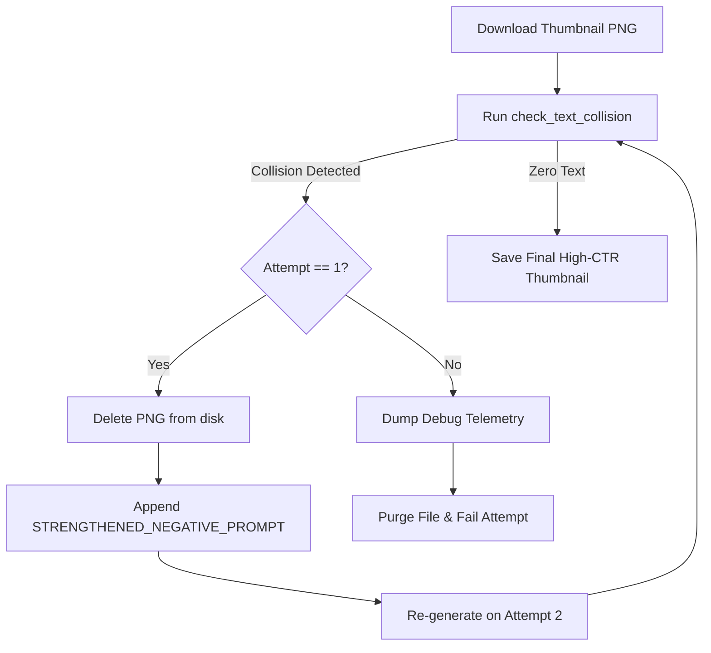

# YouTube Thumbnail Packaging: Title Synergy, Curiosity Gap Archetypes & OCR Collision Gate

## 1. Executive Summary
High click-through rate (CTR) on YouTube is governed by the psychological tension created between the **Title** and the **Thumbnail Image**. Repeating words or depicting the obvious premise kills curiosity. This document formalizes the production standard implemented in `generate_thumbnail.py`:
1. **Title + Thumbnail Synergy Law**: Zero word repetition between title text and thumbnail visual/copy.
2. **5 Curiosity Gap Archetypes**: Moment, Story, Result, Transformation, Novelty.
3. **1-Second Mobile Scan Law**: 1 dominant focal point, $\ge 40\%$ dark negative space, ultra-high contrast.
4. **Self-Critique Scoring Engine**: Top-$N$ ranking via multi-criteria evaluation.
5. **Two-Tier OCR Text Collision Gate**: Automatic detection, purge, and strengthened negative retry.

---

## 2. Title + Thumbnail Synergy Law

$$\text{Title} + \text{Thumbnail} \neq \text{Redundancy}$$
$$\text{Title (Question/Premise)} + \text{Thumbnail (Reaction/Catalyst)} = \text{Curiosity Gap}$$

- **Title Role**: Sets the intellectual premise, search intent, and driving question (e.g. *What Do Animals Think Of Humans?* or *هل تعتقد قطتك أنك قطة عملاقة؟*).
- **Thumbnail Visual Role**: Depicts the visceral consequence, absurd visual contrast, or missing puzzle piece (e.g. a tiny smug cat arrogantly observing a giant clumsy human fumbling a food bowl).
- **Thumbnail Text Overlay (Optional)**: 1–2 words maximum (e.g. "مجرد خادم!" or "شيء مرعب!"). Never repeats title vocabulary; functions strictly as an emotional trigger.

---

## 3. The 5 Curiosity Gap Archetypes

| Archetype | Cognitive Mechanism | Visual Strategy | Example (Animals Topic) |
| :--- | :--- | :--- | :--- |
| **Novelty** | Subverts biological or physical assumptions | Extreme magnification or alien perspective | Glowing dog pupil reflecting human as a walking snack fridge |
| **Result** | Shows the dramatic aftermath without explaining the cause | Shattered object, shocked posture, glowing debris | Character with broken equations or smoking calculator |
| **Story** | Mid-action frame implying high stakes | Dynamic interaction between unequal entities | Sneaky crow projecting red holographic target on human |
| **Transformation** | Subverts hierarchical status | Scale distortion, role reversal, grotesque deformation | Human distorted into awkward servant, tiny pet acting as master |
| **Moment** | Visceral peak of emotional tension | High-intensity reaction face + impending disaster | Scuba diver flailing in abyss while dolphin judges |

---

## 4. 1-Second Mobile Scan Law

More than 75% of YouTube impressions occur on mobile devices where thumbnails render at approximately $150 \times 84$ physical pixels. 

1. **Dominant Focal Mass**:
   - The primary subject must occupy $\ge 50\%$ of the active visual envelope.
   - Secondary clutter, multi-line equations, or intricate miniature machinery turn into illegible visual noise on mobile.
2. **Negative Space Buffer ($\ge 40\%$)**:
   - At least $40\%$ of the canvas must consist of deep, low-frequency background void (e.g. deep slate `#2B2D42`, abyssal navy, or obsidian).
   - Prevents visual competition with YouTube duration timestamps (bottom-right) and Arabic title text overlays.
3. **High-Contrast Silhouette Edge**:
   - Clean vector outlines ($2\text{px}$–$4\text{px}$) with directional rim lighting (neon cyan, volumetric gold, or crimson backlighting) to separate foreground entities from the background void.

---

## 5. Self-Critique & Ranking Matrix

Before committing to render expensive image generation passes, `generate_thumbnail.py` queries Gemini Pro with a structured self-critique rubric:

```json
{
  "scores": [
    {"title_index": 1, "total_score": 31},
    {"title_index": 3, "total_score": 36}
  ],
  "winners": [3, 1],
  "improvements": {
    "1": "Simplify reflection: replace walking fridge with single glowing red Snack box for 1-second mobile scan.",
    "3": "Add glowing anime sweat drop to giant character to amplify anxious servant contrast."
  }
}
```

Criteria scored (1–10 each):
- **TITLE_THUMBNAIL_SYNERGY**: Does the image complement without repeating?
- **CURIOSITY_GAP_STRENGTH**: Does the combination create an irresistible click trigger?
- **1_SECOND_MOBILE_CLARITY**: Is the silhouette readable in <1 second on a small phone screen?
- **EMOTIONAL_IMPACT**: Is the character or animal reaction visceral?

---

## 6. Two-Tier OCR Text Collision Gate

Diffusion models (Imagen, Flux, SDXL) occasionally generate garbled pseudo-alphabetic characters or unwanted labels on background items.



### Strengthened Negative Armor
```python
STRENGTHENED_NEGATIVE_PROMPT = (
    "no text, no letters, no words, no fonts, no numbers, no subtitles, "
    "no captions, no logos, no watermark, no signatures, zero writing, "
    "blank surfaces, clean unprinted background"
)
```

This automated circuit guarantees zero warped text leaks while allowing artistic typography to be overlaid deterministically in post-production.
