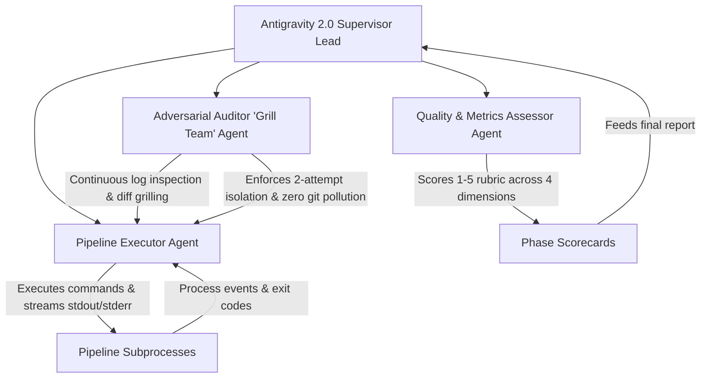
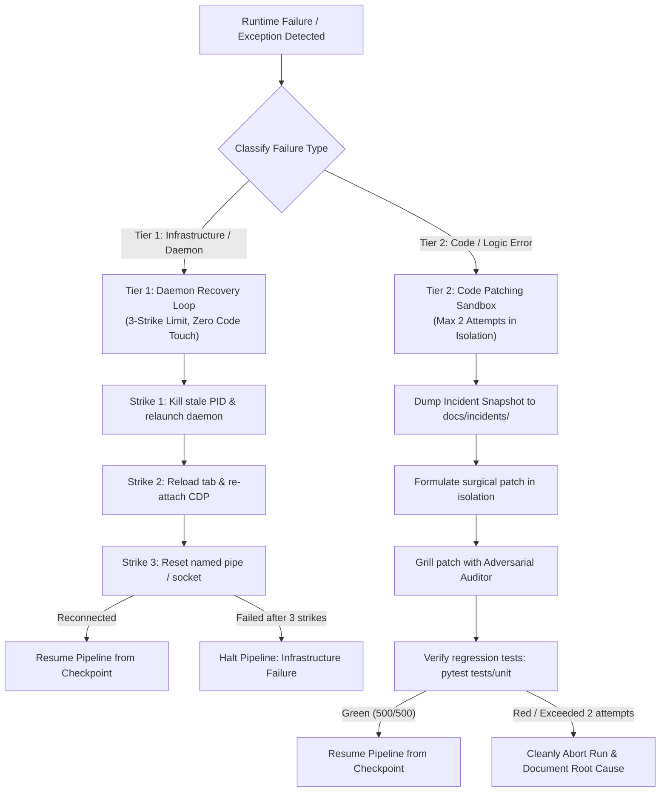

# Operational Runbook: Antigravity 2.0 Autonomous Pipeline Verification (Hardened v2.0)

> **Target Branch**: `feat/creative-prompt-script-refinement`  
> **Verification Input URL**: `https://youtube.com/watch?v=vIqTRyX-cq0` (*"What Do Animals Think Of Humans?"*)  
> **Standardized Run Directory**: `youtube_runs/What Do Animals Think Of Humans`  
> **Supervisor Role**: Antigravity 2.0 (Runtime Lead & Pipeline Supervisor)  
> **Audit Role**: Antigravity CLI (Standby / Post-Run Adversarial Auditor)  
> **Pipeline Invariant Standard**: Full 10-Phase Broadcast Pipeline (Zero Cloud SDKs, Local CDP Port 9222, Audacity Named Pipe IPC, Intel QSV / libx264 FFmpeg, Faster-Whisper ASR, Socratic 16:9 Widescreen Visuals)

---

## 1. Executive Summary & Objective

This runbook provides an exhaustive, turnkey operational blueprint for **Antigravity 2.0** to execute, supervise, and validate an end-to-end autonomous video production cycle on test YouTube video `vIqTRyX-cq0` (*"What Do Animals Think Of Humans?"*, ~6,557 characters, ~1,100 words, ~6–7 minutes target duration).

The primary objective is to prove **zero regressions, unhandled exceptions, memory leaks, audio/video drift, or branch contamination** across all 10 pipeline phases prior to opening a Pull Request into `main`.

Antigravity CLI remains on standby throughout this execution. Upon completion, Antigravity 2.0 will yield back control for a comprehensive multi-agent code, asset, and git audit.

---

## 2. Supervision & Multi-Agent Architecture

Antigravity 2.0 must instantiate a three-role delegation hierarchy to prevent single-agent confirmation bias and ensure rigorous runtime oversight:



### 2.1 Agent Role Contracts

1. **Pipeline Executor**:
   - **Mandate**: Drives command execution, manages environment variables, tracks process lifecycles (PID, CPU, RAM), pumps Playwright CDP event loops, and verifies stage exit codes.
   - **Tools**: Subprocess execution, terminal streaming, CDP WebSocket transport, file system read/write.
   - **Rule**: Never alters code or configuration without explicit authorization from the Adversarial Auditor.

2. **Adversarial Auditor ("Grill Team")**:
   - **Mandate**: Actively challenges fixes, questions assumptions, detects latent side effects, audits git diffs, enforces non-sycophantic engineering standards, and verifies that candidate patches do not corrupt existing test harnesses.
   - **Skills Active**: `grilling`, `receiving-code-review`, `diagnosing-bugs`.
   - **Rule**: Rejects any patch that mutates untracked files or touches out-of-scope modules; strictly enforces the **maximum 2-attempt retry ceiling on code patches**.

3. **Quality & Metrics Assessor**:
   - **Mandate**: Conducts formal empirical scoring (1–5 scale) after each of the 10 pipeline phases across the four standardized dimensions: Functional Correctness, Data & Media Integrity, Performance & Resource Utilization, and Branch Hygiene.
   - **Output**: Populates the Standardized Phase Scorecard Markdown table into `docs/user-reports/verification_scorecard_vIqTRyX-cq0.md`.

---

## 3. Pre-Flight Checklist & Environmental Invariants

Before launching Phase 1, Antigravity 2.0 must execute and pass every validation check below:

```bash
# ==============================================================================
# PRE-FLIGHT VERIFICATION SCRIPT (Execute sequentially)
# ==============================================================================

# 1. Branch & Git Working Tree Invariant
git rev-parse --abbrev-ref HEAD
# Assert: Must return 'feat/creative-prompt-script-refinement'

git status --short
# Assert: Must return empty (nothing to commit, working tree clean)

# Verify Git ignore and skip-worktree invariants:
git ls-files -v youtube_urls.txt
# Assert: Must return 'S youtube_urls.txt' (skip-worktree flag active, local edits invisible)
# If not active, run: git update-index --skip-worktree youtube_urls.txt

# Verify .gitignore protection for runtime and incident directories:
python -c "content = open('.gitignore').read(); assert 'youtube_runs/' in content; assert '/docs/incidents/' in content; print('Gitignore Invariants: PASS')"

# 2. Python Environment & Test Regression Baseline
python -V
# Assert: Python 3.10+ / 3.11+
python -m pytest tests/unit -q
# Assert: Exactly 500 passed in <35s (100% green)
python tools/lint_exercises.py
# Assert: 35/35 files validated, 0 errors

# 3. External Tooling & Hardware DAEMON Checks
ffmpeg -version
# Assert: FFmpeg with libx264 and (if supported) h264_qsv
ffprobe -version
# Assert: ffprobe present on system PATH

# 4. Chrome CDP Daemon on Port 9222 (Loopback Binding)
python -c "import urllib.request, json; data = json.loads(urllib.request.urlopen('http://127.0.0.1:9222/json/version', timeout=2).read()); print('CDP Ready:', data.get('Browser'))"
# If offline, auto-boot via:
python -c "from src.youtube_automation.core.utils import launch_browser_with_profile, get_runtime_state; launch_browser_with_profile('chrome', get_runtime_state('ACTIVE_PROFILE_INDEX', 'Profile 4'), 9222)"

# 5. Audacity mod-script-pipe IPC Daemon Check
# In Audacity: Preferences -> Modules -> mod-script-pipe = Enabled (Audacity 3.x must be open)
python -c "import os; print('Audacity Pipe In:', os.path.exists(r'\\.\pipe\ToSrvPipe'), '| Out:', os.path.exists(r'\\.\pipe\FromSrvPipe'))"
# Note: If pipes are False, Audacity 3.x must be launched with mod-script-pipe enabled.

# 6. Target URL Staging & Path Sanitization
# Write test target URL into youtube_urls.txt (safe under skip-worktree)
python -c "open('youtube_urls.txt', 'w', encoding='utf-8').write('https://youtube.com/watch?v=vIqTRyX-cq0\n')"

# Standardized Run Directory Definition:
# Raw Title: "What Do Animals Think Of Humans? - YouTube"
# Cleaned Slug (clean_filename): "What Do Animals Think Of Humans" (question mark and suffix stripped)
RUN_DIR="youtube_runs/What Do Animals Think Of Humans"
```

---

## 4. Working Directory & Path Unification Invariant

> [!IMPORTANT]
> **Zero Root Pollution Contract**: No media, audio, image, timeline, or video artifacts may be created directly in the repository root. Every asset produced during the verification run must reside strictly inside `$RUN_DIR/`.

### Canonical Directory Layout:
```text
youtube_runs/What Do Animals Think Of Humans/
├── pipeline.json                   # Stage completion state & script hashes
├── Video_Info.docx                 # Original video metadata & raw transcript
├── paragraphs.json                 # Structured paragraph breakdown
├── final_output.txt                # Phase 1: Al-Daheeh Arabic transcreation
├── refined_script.txt              # Phase 2: Dialect & comedic refinement
├── voice_chapters/                 # Phase 3: AI Studio neural WAV chapters
│   ├── chapter_01.wav ... chapter_NN.wav
├── voice_generation_manifest.json  # Phase 3: Synthesis checkpoint manifest
├── audacity_voice/                 # Phase 4: Audacity DSP mastered chapters
│   ├── chapter_01.wav ... chapter_NN.wav
│   └── full_episode_voice.wav      # Phase 5: Lossless master voice track
├── full_episode_voice.wav          # Phase 5: Root alias for video compiler
├── timeline.json                   # Phase 6: Canonical SSOT timeline (CFR 30.00 fps)
├── timeline.json.sha256            # Phase 6: SHA-256 sidecar verification hash
├── flow_prompts_socratic.json      # Phase 7: Socratic 6-part prompt roadmap
├── master_roadmap_socratic.jsonl   # Phase 7: Paged visual sequence metadata
├── flow_prompts.json               # Phase 8: Timestamped prompt plan
├── generated_images/               # Phase 7: Socratic 16:9 visual plates
│   ├── 00_00.png ... MM_SS.png
├── youtube_ready_video.mp4         # Phase 9: 1080p master broadcast video
├── youtube_ready_video_1080p.mp4   # Phase 9: 1080p web proxy
├── youtube_ready_video_720p.mp4    # Phase 9: 720p mobile proxy
├── studio_viewer.html              # Phase 9: Interactive comparison viewer
└── thumbnail.jpg                   # Phase 10: 1280x720 CTR thumbnail
```

---

## 5. Step-by-Step Pipeline Execution Directives

The verification processes through 10 deterministic phases. Antigravity 2.0 must execute each phase sequentially, inspect logs live, enforce phase invariants, and record scorecard results before advancing.

```mermaid
flowchart LR
    P1["Phase 1: Transcreation"] --> P2["Phase 2: Refinement"]
    P2 --> P3["Phase 3: TTS Synthesis"]
    P3 --> P4["Phase 4: Audacity DSP"]
    P4 --> P5["Phase 5: Lossless Stitch"]
    P5 --> P6["Phase 6: Whisper ASR"]
    P6 --> P7["Phase 7: Socratic Visuals"]
    P7 --> P8["Phase 8: Timestamp Alignment"]
    P8 --> P9["Phase 9: Video Compositing"]
    P9 --> P10["Phase 10: Thumbnail"]
```



---

### Phase 1: Script Extraction & Al-Daheeh Transcreation (Bounded)

> [!WARNING]
> **Stage Bounding Invariant**: Antigravity 2.0 must execute strictly `automate_all.py` in isolation. **NEVER** run `run_agency.py` during Phase 1. `run_agency.py` is the full autonomous orchestrator that would immediately loop into Phases 2–10 without per-phase supervisory gates.

- **Command**:
  ```powershell
  python -X utf8 -u automate_all.py
  ```
- **Inputs**: `youtube_urls.txt` (`https://youtube.com/watch?v=vIqTRyX-cq0`), `prompts/prompt.txt`, `prompts/prompt_phase3.txt`.
- **Execution Mechanism**:
  - Fetches YouTube transcript for `vIqTRyX-cq0` (~6,557 chars) via `youtube_transcript_api`.
  - Connects to Chrome CDP (port 9222) -> Google Gemini Web UI.
  - Chunks transcript into structured educational paragraphs (`paragraphs.json`).
  - Transcreates paragraphs into Egyptian/Khaleeji Arabic persona ("Al-Daheeh") using Gemini Pro/Flash.
  - Automatically sanitizes illegal filename characters (`?` stripped), creating `youtube_runs/What Do Animals Think Of Humans/`.
- **Expected Outputs in `$RUN_DIR`**:
  - `final_output.txt`: Complete Arabic transcreated script (>3,000 chars).
  - `paragraphs.json`: Structured paragraphs with Arabic/English mappings.
  - `Video_Info.docx`: Formatted script archive.
- **Phase Gate & Verification**:
  - `assert os.path.exists("youtube_runs/What Do Animals Think Of Humans/final_output.txt")`
  - `assert len(open("youtube_runs/What Do Animals Think Of Humans/final_output.txt", encoding="utf-8").read()) > 3000`

---

### Phase 2: Arabic Script Dialect & Slang Refinement
- **Command**:
  ```powershell
  python -X utf8 -u refine_script.py
  ```
- **Inputs**: `$RUN_DIR/final_output.txt`.
- **Execution Mechanism**:
  - Tunes vocabulary, comedic timing, and conversational flow for the Cairo host persona.
  - Enforces constraint `REFINE_MAX_SLANG_PER_SENTENCE=2` to prevent dialect opacity.
- **Expected Outputs in `$RUN_DIR`**:
  - `refined_script.txt`: Polished Arabic broadcast script.
  - `pipeline.json`: Stage state updated (`"refine": true, "script_hash": "<sha256>"`).
- **Phase Gate & Verification**:
  - `assert os.path.exists("youtube_runs/What Do Animals Think Of Humans/refined_script.txt")`
  - Verify `hashlib.sha256(open(f"{RUN_DIR}/refined_script.txt", "rb").read()).hexdigest()` matches `script_hash` in `pipeline.json`.

---

### Phase 3: AI Neural Voice Synthesis (Google AI Studio)
- **Command**:
  ```powershell
  python -X utf8 -u generate_voice.py
  ```
- **Inputs**: `$RUN_DIR/refined_script.txt`.
- **Execution Mechanism**:
  - Automatically resolves `$RUN_DIR` via `get_latest_run_folder()`.
  - Chunks script into sequential speech chapters (~15–20 chapters).
  - Automates Google AI Studio over CDP port 9222 (`TTS_MODEL=gemini-2.5-pro-preview-tts`, Voice: `Achird`, Temperature: `1.2`).
  - Downloads 24kHz/48kHz WAV files sequentially into `$RUN_DIR/voice_chapters/`.
  - Enforces multi-account failover if HTTP 403 quota exhaustion occurs.
- **Expected Outputs in `$RUN_DIR`**:
  - `voice_chapters/chapter_01.wav` ... `voice_chapters/chapter_NN.wav` (>95% script coverage).
  - `voice_generation_manifest.json`: Atomically persisted chapters metadata.
  - `pipeline.json`: `"voice": true`.
- **Phase Gate & Verification**:
  - Every chapter WAV file exists in `$RUN_DIR/voice_chapters/` with file size >10 KB.
  - Zero 0-byte or corrupted audio files.

---

### Phase 4: Studio Audio Polish & DSP Mastering (Audacity Named Pipes)
- **Command**:
  ```powershell
  python -X utf8 -u automate_audacity.py
  ```
- **Inputs**: `$RUN_DIR/voice_chapters/*.wav`.
- **Execution Mechanism**:
  - Connects to running Audacity 3.x instance via Win32 Named Pipe IPC (`\\.\pipe\ToSrvPipe` / `FromSrvPipe`).
  - Applies 5-step broadcast mastering chain:
    1. `NoiseGate`: -32dB floor attenuation.
    2. `TruncateSilence`: Truncates dead pauses >400ms to 200ms.
    3. `BassAndTreble`: +3dB low warmth, +2dB air presence.
    4. `Compressor`: -18dB threshold, 3:1 ratio, 0.2s attack.
    5. `Normalize`: Peak normalization to -1.0 dBFS.
- **Expected Outputs in `$RUN_DIR`**:
  - `audacity_voice/chapter_01.wav` ... `audacity_voice/chapter_NN.wav` (mastered chapters).
  - `pipeline.json`: `"audacity": true`.
- **Phase Gate & Verification**:
  - Mastered WAV files verified in `$RUN_DIR/audacity_voice/`.
  - Uncompressed PCM format verified; peak $\le -1.0\text{ dBFS}$.

---

### Phase 5: Lossless Master Audio Stitching
- **Command**:
  ```powershell
  python -X utf8 -u stitch_chapters.py
  ```
- **Inputs**: `$RUN_DIR/audacity_voice/chapter_*.wav`.
- **Execution Mechanism**:
  - Losslessly concatenates mastered WAV chapters in numerical sequence using Python `wave`.
  - Writes stitched master audio to both `$RUN_DIR/audacity_voice/full_episode_voice.wav` and `$RUN_DIR/full_episode_voice.wav`.
- **Expected Outputs in `$RUN_DIR`**:
  - `full_episode_voice.wav`: Master voice track (~6–7 minutes).
  - `pipeline.json`: `"stitch": true`.
- **Phase Gate & Verification**:
  - `assert os.path.exists(f"{RUN_DIR}/full_episode_voice.wav")`
  - Duration matches sum of chapter lengths within $\pm 0.05\text{s}$.

---

### Phase 6: Speech Alignment & Canonical Timeline SSOT
- **Command**:
  ```powershell
  python -X utf8 -u faster_whisper_transcribe_audio.py
  ```
- **Inputs**: `$RUN_DIR/full_episode_voice.wav`, `$RUN_DIR/refined_script.txt`.
- **Execution Mechanism**:
  - Transcribes master audio via Faster-Whisper ASR model with Silero VAD pause alignment.
  - Aligns word boundaries monotonically with `spelling_corrector.py` against `refined_script.txt`.
  - Builds the Single Source of Truth (`timeline.json`) with cumulative integer frame quantization ($30.00\text{ fps}$).
  - Atomically writes SHA-256 sidecar: `timeline.json.sha256`.
- **Expected Outputs in `$RUN_DIR`**:
  - `timeline.json`: Canonical SSOT (~80–110 spans).
  - `timeline.json.sha256`: Cryptographic integrity sidecar.
  - `pipeline.json`: `"transcribe": true`.
- **Phase Gate & Verification**:
  - Cumulative frame count equals `round(audio_duration * 30.0)`.
  - A/V drift $\le 0.02\text{s}$ across entire duration.
  - Sidecar hash verified: `hashlib.sha256(open(f"{RUN_DIR}/timeline.json", "rb").read()).hexdigest() == open(f"{RUN_DIR}/timeline.json.sha256").read().strip()`.

---

### Phase 7: Storyboard Roadmap Planning & Flow Socratic Visuals
- **Commands**:
  ```powershell
  # Step 7A: Roadmap planning (paged 25-row windows)
  python -X utf8 -u roadmap_orchestrator.py
  
  # Step 7B: Batch generation via Google Flow CDP
  python -X utf8 -u flow_image_generator.py
  ```
- **Inputs**: `$RUN_DIR/timeline.json`, `$RUN_DIR/refined_script.txt`, Google Flow (`https://flow.google.com/`).
- **Execution Mechanism**:
  - `roadmap_orchestrator.py`: Generates `flow_prompts_socratic.json` and `master_roadmap_socratic.jsonl` using Universal 6-Part Prompt Grammar, 16:9 Foveal Safe Envelope ($X: 180\dots 1740, Y: 90\dots 980$), Orthographic 2D camera DNA, and unified `#F8F8FA` / `#2A2420` studio substrates.
  - `flow_image_generator.py`: Generates images over CDP port 9222 into `$RUN_DIR/generated_images/`.
    - Card-spawn handshake ($\le 20\text{s}$).
    - Scoped watchdog ($120\text{s}$ stall ceiling, $360\text{s}$ hard ceiling).
    - Network-stream image extraction with blank canvas validation.
    - OCR Text Gate (`text_gate.py`): Rejects any image with text leaks.
- **Expected Outputs in `$RUN_DIR`**:
  - `generated_images/` containing ~80–110 sequential PNG images (`00_00.png` ...).
  - `pipeline.json`: `"images": true`.
- **Phase Gate & Verification**:
  - 100% of images pass OCR text gate (`ocr_text: NONE`).
  - Zero duplicate SHA-256 hashes across consecutive frames.
  - Every image is $>50\text{ KB}$ and $1920\times 1080$ or $2560\times 1440$.

---

### Phase 8: Timestamp Alignment & Invariant Verification (Read-Only SSOT)

> [!IMPORTANT]
> **Phase 8 Timeline Immutability Contract**: `fix_timestamps.py` operates strictly on `timestamped_transcript.txt` and `flow_prompts.json`. It treats `timeline.json` as **STRICTLY READ-ONLY**. `timeline.json.sha256` generated in Phase 6 remains unchanged.

- **Command**:
  ```powershell
  python -X utf8 -u fix_timestamps.py
  ```
- **Inputs**: `$RUN_DIR/generated_images/`, `$RUN_DIR/timestamped_transcript.txt`, `$RUN_DIR/flow_prompts.json`.
- **Execution Mechanism**:
  - Injects formatted timestamps into `flow_prompts.json`.
  - If images on disk are already sorted by timeline index, automatically skips redundant operations.
- **Expected Outputs in `$RUN_DIR`**:
  - `flow_prompts.json`: Updated prompt index.
  - `pipeline.json`: `"fixtimes": true`.
- **Phase Gate & Verification**:
  - `timeline.json` SHA-256 hash must remain strictly identical to `timeline.json.sha256` from Phase 6.

---

### Phase 9: Hardware Video Compositing & Broadcast Master Rendering
- **Command**:
  ```powershell
  python -X utf8 -u compile_video.py "youtube_runs/What Do Animals Think Of Humans"
  ```
- **Inputs**: `$RUN_DIR/timeline.json`, `$RUN_DIR/generated_images/`, `$RUN_DIR/full_episode_voice.wav`.
- **Execution Mechanism**:
  - Ingests canonical timeline bypassing acoustic re-snapping.
  - Computes exact duration from WAV header (`wf.getnframes() / wf.getframerate()`).
  - Enriches timeline kinetics via `enrich_timeline_kinetics`: detects audio transients via `AudioTransientDetector` (+33.3ms optical lag delay), subdivides long holds ($\ge 4.0\text{s}$) into setup and reaction scale punches ($1.25\times$), applies clamped zero-safe drift `min(1.03, 1.0 + 0.03 * (clip(on, 0, N) / max(1, N)))`, and **atomically resynchronizes `timeline.json.sha256`**.
  - Composites 20-clip chunks via FFmpeg:
    - Intel QSV: `h264_qsv` with `look_ahead=0` and `format=nv12`.
    - Fallback: `libx264` (`preset=veryfast, crf=17, tune=animation, profile=high`).
  - Burns Arabic ASS subtitles formatted with Cairo/Tajawal font stack.
  - Applies two-pass EBU R128 loudness normalization (-14 LUFS target).
  - Exports proxy ladder: 1080p master, 1080p web proxy, 720p mobile proxy.
- **Expected Outputs in `$RUN_DIR`**:
  - `youtube_ready_video.mp4`: Full broadcast master video (~6–7 minutes).
  - `youtube_ready_video_1080p.mp4`: 1080p proxy.
  - `youtube_ready_video_720p.mp4`: 720p proxy.
  - `studio_viewer.html`: Interactive side-by-side comparison studio.
  - `pipeline.json`: `"video": true`.
- **Phase Gate & Verification**:
  - `validate_post_encode()` passes cleanly with 0 errors.
  - Total video duration matches audio within $\le 0.02\text{s}$.
  - Exactly $30.00\text{ fps}$ CFR, zero dropped frames, valid audio stream.

---

### Phase 10: YouTube Thumbnail Optimization
- **Command**:
  ```powershell
  python -X utf8 -u generate_thumbnail.py
  ```
- **Inputs**: `$RUN_DIR/refined_script.txt`, `$RUN_DIR/final_output.txt`.
- **Execution Mechanism**:
  - Analyzes hook and core dilemma of the episode.
  - Synthesizes YouTube CTR thumbnail prompt with Da Vinci Sfumato chiaroscuro.
  - Renders $1280\times 720$ thumbnail asset in `$RUN_DIR/thumbnail.jpg`.
- **Expected Outputs in `$RUN_DIR`**:
  - `thumbnail.jpg`: High-CTR thumbnail graphic.
  - `pipeline.json`: `"thumbnail": true`.
- **Phase Gate & Verification**:
  - `assert os.path.exists("youtube_runs/What Do Animals Think Of Humans/thumbnail.jpg")`
  - File size $>50\text{ KB}$, dimensions $1280\times 720$.

---

## 6. Incident Response & Self-Healing Protocol (Two-Tier Separation)

To prevent wasting code patch attempts on transient environmental hiccups, Antigravity 2.0 must separate **Infrastructure / Daemon Restarts** from **Code / Script Patches**:



### 6.1 Tier 1: Infrastructure & Daemon Reconnection Protocol (Non-Code Budget)
- **Scope**: Chrome CDP port 9222 disconnected, browser crashed, Google Flow/AI Studio tab unloaded, Audacity named pipe closed (`\\.\pipe\ToSrvPipe`), network socket timeout.
- **Rule**: Does **NOT** consume the 2-attempt code patch budget.
- **Protocol (3-Strike Limit)**:
  - **Strike 1**: Terminate stale port PID via `kill_cdp_chrome(9222)`, relaunch browser via `launch_browser_with_profile("chrome", active_profile, 9222)`, and poll loopback socket for 15s.
  - **Strike 2**: Re-attach Playwright CDP context, navigate explicitly to target application (`flow.google.com` or `aistudio.google.com`), and dismiss blocking modals or cookies.
  - **Strike 3**: If Audacity Named Pipe IPC is disconnected, verify `audacity.exe` is running with `mod-script-pipe` enabled; ping pipe endpoints.
  - If unresolved after 3 strikes: Halt pipeline with an **Infrastructure Error** and document required daemon intervention. Do NOT attempt to alter Python code files!

### 6.2 Tier 2: Code & Logic Patching Protocol (Strict 2-Attempt Budget)
- **Scope**: Python exceptions, syntax/type errors, regex mutations, assertion failures, schema validation rejections.
- **Protocol (Maximum 2 Attempts)**:
  1. Immediately halt pipeline execution.
  2. Dump incident snapshot to `docs/incidents/INCIDENT_<phase>_<timestamp>.md` with failing command, stack trace, and target directory state.
  3. Formulate targeted surgical patch in isolation.
  4. Submit patch to Adversarial Auditor ("Grill Team") for critique.
  5. Run full regression suite:
     ```powershell
     python -m pytest tests/unit -q && python tools/lint_exercises.py
     ```
     Both must pass 100% green (500 tests, 35 exercise files).
  6. Resume pipeline from the last stable checkpoint recorded in `pipeline.json`.
  7. If the patch fails a second time: Cleanly abort the pipeline, revert candidate changes via `git restore`, and document the blocking root cause.

---

## 7. Phase Assessment & Scorecard Markdown Template

After completing each phase, Antigravity 2.0 must fill out this scorecard and append it to `docs/user-reports/verification_scorecard_vIqTRyX-cq0.md`:

```markdown
### Phase [N]: [Phase Name]
**Timestamp**: [ISO 8601 Timestamp]  
**Duration**: [Elapsed Time in seconds/minutes]  
**Command Executed**: `[Command]`  

| Evaluation Dimension | Score (1–5) | Justification & Verification Evidence |
| :--- | :---: | :--- |
| **Functional Correctness** | [Score] | [Produced expected files in $RUN_DIR with exit code 0; zero unhandled exceptions] |
| **Data & Media Integrity** | [Score] | [Files uncorrupted, WAV headers valid, timeline CFR intact, 0 OCR text leaks] |
| **Performance & Resource** | [Score] | [Completed within expected time envelope; no memory leaks or GPU crashes] |
| **Branch Hygiene** | [Score] | [Production working tree (src/, tests/, exercises/, tools/) clean; zero untracked debris] |

**Phase Verdict**: [PASS / WARN / FAIL]  
**Artifact Hashes**:
- `[File 1]`: `[SHA-256]`
- `[File 2]`: `[SHA-256]`
```

---

## 8. Final Handoff & Audit Package

Upon completion of Phase 10, Antigravity 2.0 must compile the final deliverables package for Antigravity CLI audit:

1. **Pipeline Execution Telemetry**:
   - Total elapsed runtime from start to finish.
   - Complete 10-phase scorecard in `docs/user-reports/verification_scorecard_vIqTRyX-cq0.md` with cumulative score (Target: $\ge 19/20$ across all phases).
2. **Git Status & Working Tree Audit**:
   - Run `git status` (must be clean, with runtime artifacts isolated in `youtube_runs/` and `docs/incidents/`).
   - Run `git diff main...HEAD --stat` to verify total branch surface area.
3. **Media Stream Verification**:
   - Master video duration vs audio duration probe output (drift must be $\le 0.02\text{s}$).
   - Stream spec: H.264 High Profile, $1920\times 1080$, $30.00\text{ fps}$ CFR, AAC audio, YUV420p.
4. **Studio Viewer & Media Links**:
   - Clickable file link to `youtube_runs/What Do Animals Think Of Humans/studio_viewer.html`.
   - Clickable file link to `youtube_runs/What Do Animals Think Of Humans/youtube_ready_video.mp4`.
5. **Standby Handback**:
   - Antigravity 2.0 hands back control to Antigravity CLI for final architecture, regression, and safety clearance.
