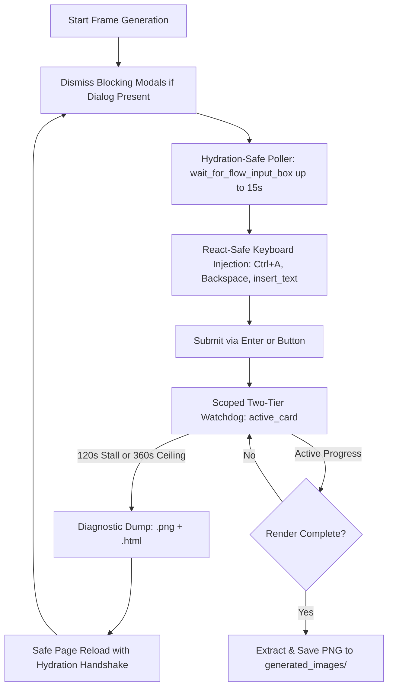

# Flow Image Generator Resiliency & Hydration Recovery Implementation Plan (v2 - Ratified)

> **For agentic workers:** REQUIRED SUB-SKILL: Use superpowers:subagent-driven-development (recommended) or superpowers:executing-plans to implement this plan task-by-task. Steps use checkbox (`- [ ]`) syntax for tracking.

**Goal:** Diagnose, refactor, and harden `flow_image_generator.py` (`src/youtube_automation/visuals/flow_generator.py`, `cdp_client.py`, and `utils.py`) to eliminate the 120s DOM progress freeze, post-reload prompt selector failures, and cascading account rotation terminations (Termination ID `52ce6b10-97f1-4701-a7da-31b5f3c77922-4732`), and establish formulative pedagogy drill `exercises/03-browser-cdp/03.03-flow-hydration-recovery/`.

**Architecture:** Implement an enterprise-grade 5-tier self-healing automation loop:
1. **Chromium Anti-Occlusion & Anti-Throttling Launch Configuration**: Disable Windows native occlusion and budget-based web worker/timer throttling.
2. **Event-Loop Pumping & Hydration Poller**: Replace all synchronous `time.sleep()` calls in browser loops with native `page.wait_for_timeout()` and implement multi-strategy polling for `contenteditable` prompt bars.
3. **React SyntheticEvent-Safe Keyboard Injection**: Focus, clear (`Ctrl+A` + `Backspace`), and inject text via hardware-level `keyboard.insert_text()`.
4. **Scoped Generation Card Watchdog & Two-Tier Timeout**: Track DOM activity strictly on the newest generation card container, enforcing a 120s stall timeout and a 360s absolute generation ceiling.
5. **Dual Diagnostic Artifact Dumper**: Automatically save paired `{base_path}.png` and `{base_path}.html` DOM snapshots on any stall or selector failure.

**Tech Stack:** Python 3.11+, Playwright Python Sync API, Chrome DevTools Protocol (CDP loopback `127.0.0.1:9222`), Pytest.

**Spec:** [USER_REQUEST](conversation://e9fd44f1-e808-47a6-92a0-6dd891407ff4) & [GEMINI.md](file:///C:/Users/Snoozer/Downloads/Antigravity/Youtube%20Automation%202/buckup/Version%204%20before%20deepseek%20implementation%20plan/image_generation/GEMINI.md).

## Global Constraints
- **Zero Cloud SDKs**: Automation operates strictly through local Playwright CDP loopback on `127.0.0.1:9222`.
- **Atomic State Integrity**: Checkpoints, `runtime_state.json`, and manifests must be written via atomic replace (`NamedTemporaryFile` + `os.replace` + `fsync`).
- **Preserve Existing Assets**: Never overwrite or delete already generated frames (`generated_images/*.png`), `flow_prompts.json`, or `master_roadmap.jsonl`.
- **Pedagogy Invariant**: All exercises under `exercises/` must strictly pass `python tools/lint_exercises.py` (dash-cased naming, `readme.md`, `exercise.py`, `test_exercise.py`, zero broken links).

---

## Technical Audit of Review Comments

| # | Item | Risk Level | Audit Finding & Architectural Decision |
| :--- | :--- | :--- | :--- |
| **1.1** | **Chromium Occlusion Flags** | HIGH | **Accepted**. Windows DWM calculates native occlusion (`CalculateNativeWinOcclusion`) and throttles background timers/rAF to 1Hz when the browser window is occluded by the terminal or minimized. Adding `--disable-features=CalculateNativeWinOcclusion,IntensiveWakeUpThrottling` and `--disable-background-media-suspend` to `utils.py` ensures full-speed execution. |
| **2.1** | **Event-Loop Pumping** | BLOCKER | **Accepted**. In Playwright's sync API (greenlet architecture), `time.sleep()` freezes the dispatch thread, preventing incoming CDP frames and mutation observer notifications from being received. Replacing all polling sleeps with `page.wait_for_timeout()` pumps the transport loop while yielding. |
| **2.2** | **React Synthetic State Injection** | CRITICAL | **Accepted**. Google Flow's Lexical/ProseMirror `contenteditable` container requires native `beforeinput` / `InputEvent` dispatches to update internal React state. Using `keyboard.press("Control+a")`, `keyboard.press("Backspace")`, and `keyboard.insert_text(prompt)` guarantees the Generate button enables reliably. |
| **2.3** | **Scoped Card Watchdog** | HIGH | **Accepted**. Global page queries for `.animate-pulse` or `skeleton` cause false-positive activity detection from old, historical cards (Frames 1–20). Scoping the watcher to `active_card` (the last child container in `[role='feed']` or `.generation-card:last-child`) and adding a two-tier timeout (120s stall + 360s hard ceiling) prevents both false generation and infinite stalls. |
| **2.4** | **Guarded Overlay Sweeper** | MEDIUM | **Accepted**. Blindly pressing `Escape` clears active prompt buffers. The sweeper now affirmatively tests if a visible dialog exists (`page.locator("[role='dialog'], [role='alertdialog'], .modal-backdrop").first.is_visible()`), clicks its close/dismiss button first, and only falls back to `Escape` when the modal is affirmatively detected. |
| **2.5** | **Dual Raster & DOM Dump** | HIGH | **Accepted**. Screenshots alone miss hidden `z-index` overlays, iframe barriers, or detached nodes. `dump_diagnostic_artifact` will dump both `{path}.png` and `{path}.html` for every timeout. |
| **3.1** | **Mock Hydration Delays** | MEDIUM | **Accepted**. Pedagogy drill `03.03` uses a local HTML fixture with `setTimeout(..., 4000)` to deterministically test the 15-second poller in CI/CD without external network access. |

---

## Proposed Changes



### Component 1: Browser Launch & CDP Hardening
#### [MODIFY] [`src/youtube_automation/core/utils.py`](file:///C:/Users/Snoozer/Downloads/Antigravity/Youtube%20Automation%202/buckup/Version%204%20before%20deepseek%20implementation%20plan/image_generation/src/youtube_automation/core/utils.py)
- In `launch_browser_with_profile`:
  Append the full set of anti-occlusion and anti-throttling flags:
  ```python
  "--disable-renderer-backgrounding",
  "--disable-background-timer-throttling",
  "--disable-backgrounding-occluded-windows",
  "--disable-features=CalculateNativeWinOcclusion,IntensiveWakeUpThrottling",
  "--disable-background-media-suspend",
  "--no-first-run",
  "--no-default-browser-check",
  ```

#### [MODIFY] [`src/youtube_automation/browser/cdp_client.py`](file:///C:/Users/Snoozer/Downloads/Antigravity/Youtube%20Automation%202/buckup/Version%204%20before%20deepseek%20implementation%20plan/image_generation/src/youtube_automation/browser/cdp_client.py)
- In `prepare_browser_context`:
  Set standard 1920x1080 viewport and grant required permissions without unhandled exceptions.

---

### Component 2: Flow Generator Resiliency & Hydration Polling
#### [MODIFY] [`src/youtube_automation/visuals/flow_generator.py`](file:///C:/Users/Snoozer/Downloads/Antigravity/Youtube%20Automation%202/buckup/Version%204%20before%20deepseek%20implementation%20plan/image_generation/src/youtube_automation/visuals/flow_generator.py)
- **Implement `wait_for_flow_input_box(page, timeout_seconds=15)`**:
  - Uses `page.wait_for_timeout(300)` in a loop pumping CDP events.
  - Queries:
    1. `div[contenteditable='true']` with width > 300px
    2. `textarea[placeholder*='What do you want' i]`
    3. `input[placeholder*='What do you want' i]`
    4. `[role='textbox'][contenteditable='true']`
  - Returns locator immediately once mounted and visible.
- **Implement `inject_prompt_safely(page, input_locator, prompt_text: str)`**:
  - `input_locator.click()` -> `page.wait_for_timeout(200)`
  - `page.keyboard.press("Control+a")` -> `page.keyboard.press("Backspace")` -> `page.wait_for_timeout(100)`
  - `page.keyboard.insert_text(prompt_text)` -> `page.wait_for_timeout(300)`
- **Implement `dismiss_blocking_flow_modals(page)`**:
  - Guarded: checks `modal = page.locator("[role='dialog'], [role='alertdialog'], .modal-backdrop").first`
  - If `modal.is_visible()`: clicks close button (`button[aria-label*='close' i]`, `Got it`, `Dismiss`), or presses `Escape` only while modal is confirmed visible.
- **Harden Scoped Generation Activity Watchdog**:
  - Identify `active_card = flow_page.locator("div[data-card-index]:last-child, .generation-card:last-child, [role='article']:last-child").first`
  - Check activity specifically within `active_card`:
    - `active_card.locator("[role='progressbar']").is_visible()`
    - `active_card.get_by_text(re.compile(r"\d+%")).first.is_visible()`
    - `active_card.locator(".animate-pulse, [class*='shimmer'], [class*='skeleton']").first.is_visible()`
  - Implement two-tier timer:
    - 120s stall timeout: no activity on `active_card` for 120s -> reload.
    - 360s hard ceiling: generation exceeds 6 minutes -> abort & rotate.
- **Implement `dump_diagnostic_artifact(page, frame_idx: int, attempt: int, subfolder: str)`**:
  - Saves `{debug_dir}/error_frame_{frame_idx:03d}_att{attempt}_{timestamp}.png`
  - Saves `{debug_dir}/error_frame_{frame_idx:03d}_att{attempt}_{timestamp}.html` (full `page.content()`)
- **Harden Workspace Resumption & Fast-Fail**:
  - Bounded 15s timeout for `page.goto(project_url)`.
  - On failure, atomically replace `flow_workspace_url_profile_<idx>.txt` and initialize fresh project via `FlowSelectors.URL`.
- **Calibrate Safe Coordinates in `wake_up_page()`**:
  - Change mouse coordinates from dangerous `(500, 500)` to neutral corner `(100, 15)`.

---

### Component 3: Pedagogy Scaffold & Drill 03.03
#### [NEW] [`exercises/03-browser-cdp/03.03-flow-hydration-recovery/readme.md`](file:///C:/Users/Snoozer/Downloads/Antigravity/Youtube%20Automation%202/buckup/Version%204%20before%20deepseek%20implementation%20plan/image_generation/exercises/03-browser-cdp/03.03-flow-hydration-recovery/readme.md)
- Complete drill documentation, architecture diagram, and links to variants.

#### [NEW] [`exercises/03-browser-cdp/03.03-flow-hydration-recovery/explainer/readme.md`](file:///C:/Users/Snoozer/Downloads/Antigravity/Youtube%20Automation%202/buckup/Version%204%20before%20deepseek%20implementation%20plan/image_generation/exercises/03-browser-cdp/03.03-flow-hydration-recovery/explainer/readme.md)
- In-depth architectural explainer of:
  - SPA Client-Side Hydration vs `domcontentloaded`
  - SyntheticEvent listeners vs direct DOM text manipulation
  - Chromium Native Window Occlusion & Background Timer Throttling
  - Scoped Generation Card Diffing vs Global DOM Polling

#### [NEW] [`exercises/03-browser-cdp/03.03-flow-hydration-recovery/problem/exercise.py`](file:///C:/Users/Snoozer/Downloads/Antigravity/Youtube%20Automation%202/buckup/Version%204%20before%20deepseek%20implementation%20plan/image_generation/exercises/03-browser-cdp/03.03-flow-hydration-recovery/problem/exercise.py)
- Student workspace reproducing the race condition with mock DOM pages and `# TODO` tags.

#### [NEW] [`exercises/03-browser-cdp/03.03-flow-hydration-recovery/solution/exercise.py`](file:///C:/Users/Snoozer/Downloads/Antigravity/Youtube%20Automation%202/buckup/Version%204%20before%20deepseek%20implementation%20plan/image_generation/exercises/03-browser-cdp/03.03-flow-hydration-recovery/solution/exercise.py)
- Reference implementation featuring resilient polling, overlay dismissal, scoped card watching, and diagnostic dumping.

#### [NEW] [`exercises/03-browser-cdp/03.03-flow-hydration-recovery/solution/test_exercise.py`](file:///C:/Users/Snoozer/Downloads/Antigravity/Youtube%20Automation%202/buckup/Version%204%20before%20deepseek%20implementation%20plan/image_generation/exercises/03-browser-cdp/03.03-flow-hydration-recovery/solution/test_exercise.py)
- Pytest suite testing:
  - Local HTML fixture with `setTimeout(..., 4000)` asserting `wait_for_flow_input_box` waits and succeeds.
  - Guarded modal dismissal without blind Escape.
  - Paired `.png` + `.html` diagnostic artifact generation.

---

### Component 4: Error Learning & Continuity Ledger Documentation
#### [MODIFY] [`docs/error-solving/understood-errors.md`](file:///C:/Users/Snoozer/Downloads/Antigravity/Youtube%20Automation%202/buckup/Version%204%20before%20deepseek%20implementation%20plan/image_generation/docs/error-solving/understood-errors.md)
- Document new error pattern: `Google Flow Post-Reload SPA Hydration Race Condition & Native Window Occlusion Throttling`.

#### [MODIFY] [`docs/short-term-plan/CONTINUITY.md`](file:///C:/Users/Snoozer/Downloads/Antigravity/Youtube%20Automation%202/buckup/Version%204%20before%20deepseek%20implementation%20plan/image_generation/docs/short-term-plan/CONTINUITY.md)
- Update state: Phase 2 visual generation at Frame 21, hardening plan v2 approved.

---

## Verification Plan

### Automated Tests
1. Run exercise linter:
   ```bash
   python tools/lint_exercises.py
   ```
   *Expected: All exercise sections and drills pass with 0 errors.*
2. Run unit tests for drill 03.03:
   ```bash
   python -m pytest exercises/03-browser-cdp/03.03-flow-hydration-recovery/solution/test_exercise.py -v
   ```
   *Expected: 100% tests pass.*
3. Run existing browser & visual unit tests:
   ```bash
   python -m pytest tests/unit/ -v
   ```
   *Expected: Zero regressions across all test suites.*

### Manual & Pipeline Verification
1. Verify prompt input detection and event-loop pumping on live Google Flow tab:
   Run diagnostic script confirming `wait_for_flow_input_box` resolves the active prompt bar in < 1 second using `page.wait_for_timeout`.
2. Launch live visual generation:
   ```bash
   python -u flow_image_generator.py
   ```
   Verify smooth resumption: skips Frames 1–20, renders Frame 21 (`01_23.png`) and subsequent frames without stalling or false account failovers.
