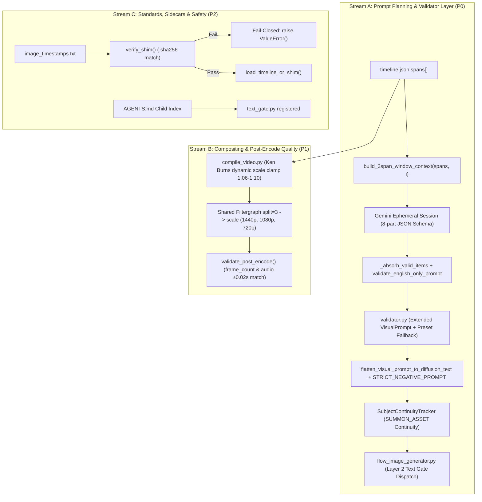

# Implementation Plan: Spec #12 Code Review Remediation & Quality Hardening (Audited & Refined)

## Goal Description
Remediate the findings from the two-axis code review across commits `84f4084` through `893a13c` (Tickets #14–#19 implementing Spec #12: *Robust Dynamic Harmonious Video Pipeline*), incorporating the audited adjustments from the deep-dive agent review.

The primary objectives:
1. **Validator & Prompt Planner Alignment (P0 Blocker)**: Eliminate schema drift between `prompt_planner.py` and `validator.py`. Extend `validator.VisualPrompt` and `validator.flatten_visual_prompt_to_diffusion_text` to support the 8-part English-only diffusion schema (`subject`, `action`, `setting`, `mood`, `lighting`, `composition`, `style`, `negative_prompt`, `continuity_id`) with automatic preset fallback, while maintaining backward compatibility with legacy payloads.
2. **Wire 3-Span Window & Dual-Boundary Text Gate (P0)**: Wire `build_3span_window_context` and `SubjectContinuityTracker` into `_plan_single_chunk`. Enforce `validator.validate_english_only_prompt` and `validator.purge_subtitle_phrases` at both planner absorption and Flow generator dispatch boundaries.
3. **Ken Burns Dynamic Clamping & Post-Encode Zero-Drift Gate (P1)**: Activate duration-based scale clamping (`1.06`–`1.10`) by default in `compile_video.py`. Implement `validate_post_encode` checking `frame_count == round(duration * 30)` and `abs(video_duration - audio_duration) <= 0.02s` (fail-fast `RuntimeError`). Implement/audit single-invocation ladder filtergraph (`split=3 → scale`).
4. **Defensive Shims & Standards Compliance (P2)**: Enforce fail-closed `.sha256` sidecar verification in `timeline_engine.py:load_timeline_or_shim` and `compile_video.py:parse_image_timeline`. Audit UTF-8 stdout reconfiguration across all modules, and register `text_gate.py` in the `AGENTS.md` root Child DOX Index.
5. **Full TDD Verification (P3)**: Run and expand the existing 24-file unit and integration test suite to verify 100% green compliance.

---

## User Review Required

> [!IMPORTANT]
> **Validator Schema Drift Solution (Stream A Blocker)**
> Swapping `prompt_planner.py` directly to the 8-part schema would crash `validator.py` (`FrameItem.model_validate`, `style_anchor` keyword checks, and `flatten_visual_prompt_to_diffusion_text`). 
> **Decision**: We extend `VisualPrompt` with optional 8-part fields, update `flatten_visual_prompt_to_diffusion_text` to synthesize elevated diffusion prompts from both schemas, inject preset defaults for missing style/lighting tokens, and make `style_anchor` keyword checks conditional on legacy schema use.

> [!WARNING]
> **Fail-Closed Shim Invalidation (Stream C)**
> Per Spec line 73 (*"consumer must refuse stale shim"*), if a shim file (`image_timestamps.txt`, `timestamped_transcript.txt`) lacks a valid matching `.sha256` sidecar corresponding to `timeline.json`, the loader will raise a `ValueError` rather than silently continuing with potentially desynced data.

---

## Architecture & Data Flow



---

## Proposed Changes

### Stream A: Validator Schema Migration & Prompt Planner Wiring (P0)

#### [MODIFY] [validator.py](file:///C:/Users/Snoozer/Downloads/Antigravity/Youtube%20Automation%202/buckup/Version%204%20before%20deepseek%20implementation%20plan/image_generation/validator.py)
- **Extend `VisualPrompt`**: Add optional fields matching the 8-part schema with backward compatibility:
  ```python
  class VisualPrompt(BaseModel):
      model_config = ConfigDict(extra="ignore")

      # Legacy fields (optional for backward compat)
      subject_details: str = ""
      subject_action_increment: str = ""
      environment_coordinates: str = ""
      composition_layout: str = ""
      camera_specifications: str = ""
      text_overlay_arabic: str = "NONE"
      accent_color_hook: str = ""
      style_anchor: str = ""

      # Spec #12 8-part fields
      subject: str = ""
      action: str = ""
      setting: str = ""
      mood: str = ""
      lighting: str = ""
      composition: str = ""
      style: str = ""
      negative_prompt: str = ""
      continuity_id: str = ""
  ```
- **Update `flatten_visual_prompt_to_diffusion_text`**: Support 8-part attributes (`subject`, `action`, `setting`, etc.) with fallback to legacy field names (`subject_details`, etc.). If `style` or `lighting` is missing, inject preset broadcast defaults from `STYLE_DNA_TEXT`. Inject `STRICT_NEGATIVE_PROMPT` deterministically.
- **Update `_collect_schema_and_content_violations`**: Enforce that either `subject` or `subject_details` is non-empty. Only enforce `style_anchor` keyword check (`3px`, `vector`, `cel-shading`) when `style_anchor` is explicitly present in a legacy payload.

#### [MODIFY] [prompt_planner.py](file:///C:/Users/Snoozer/Downloads/Antigravity/Youtube%20Automation%202/buckup/Version%204%20before%20deepseek%20implementation%20plan/image_generation/prompt_planner.py)
- **Update `_SCHEMA_HINT`**: Replace legacy typography schema with clean 8-part diffusion JSON schema (Spec line 79).
- **Wire 3-Span Window**: Update `_plan_single_chunk` to construct the prompt payload by iterating spans and invoking `build_3span_window_context(spans, index)`, providing previous and next pause boundaries.
- **Wire `SubjectContinuityTracker`**: Register subjects and assign `continuity_id` (`SUBJ_01`, etc.) or `@asset` chips for recurring characters/scenes.
- **Planner Dual-Gate**: In `_absorb_valid_items`, run `validate_english_only_prompt` on every candidate item; if Arabic characters are detected, trigger prompt repair / transliteration fallback.

#### [MODIFY] [flow_image_generator.py](file:///C:/Users/Snoozer/Downloads/Antigravity/Youtube%20Automation%202/buckup/Version%204%20before%20deepseek%20implementation%20plan/image_generation/flow_image_generator.py)
- **Dispatch Gate**: Before sending prompt text to browser via CDP in `generate_image_for_frame`, run `validator.validate_english_only_prompt` and `validator.purge_subtitle_phrases`.

---

### Stream B: Ken Burns Dynamic Scale & Post-Encode Quality Gates (P1)

#### [MODIFY] [compile_video.py](file:///C:/Users/Snoozer/Downloads/Antigravity/Youtube%20Automation%202/buckup/Version%204%20before%20deepseek%20implementation%20plan/image_generation/compile_video.py)
- **Invert Dynamic Ken Burns Default**: In `build_ken_burns_filter`:
  ```python
  # Dynamic scale is default per spec.md:85
  dynamic_scale = round(max(1.06, min(1.10, 1.06 + (duration - 2.5) / 2.0 * 0.04)), 3)
  if "KEN_BURNS_ZOOM_MAX" in config:
      zoom_max = min(dynamic_scale, float(config["KEN_BURNS_ZOOM_MAX"]))
  else:
      zoom_max = dynamic_scale
  ```
- **Implement `validate_post_encode`**: Define helper next to `get_audio_duration`:
  ```python
  def validate_post_encode(video_path: str, audio_duration: float, fps: int = 30) -> None:
      # Query nb_frames and duration via ffprobe
      # Check frame_count == round(audio_duration * fps)
      # Check abs(video_duration - audio_duration) <= 0.02
      # If drift exceeds tolerance: raise RuntimeError(f"Post-encode zero-drift validation failed: ...")
  ```
- **Wire into `_execute_final_assembly`**: Call `validate_post_encode` immediately upon successful ffmpeg returncode.
- **Audit Proxy Ladder Execution**: Update `export_proxy_ladder` to properly consume `encoder_config` codec and args.

---

### Stream C: Standards, Sidecar Verification & Console Safety (P2)

#### [MODIFY] [timeline_engine.py](file:///C:/Users/Snoozer/Downloads/Antigravity/Youtube%20Automation%202/buckup/Version%204%20before%20deepseek%20implementation%20plan/image_generation/timeline_engine.py)
- **UTF-8 Console Reconfiguration**: Add standard guarded reconfigure at module top with `hasattr(sys.stdout, "reconfigure")`.
- **Fail-Closed Shim Invalidation**: In `load_timeline_or_shim`:
  ```python
  if not os.path.exists(txt_path):
      return blocks
  if not verify_shim(txt_path):
      raise ValueError(f"Shim file '{txt_path}' failed SHA-256 verification against timeline.json")
  ```

#### [MODIFY] [compile_video.py](file:///C:/Users/Snoozer/Downloads/Antigravity/Youtube%20Automation%202/buckup/Version%204%20before%20deepseek%20implementation%20plan/image_generation/compile_video.py)
- **Fail-Closed Shim Check in `parse_image_timeline`**: If `timeline.json` is absent and `image_timestamps.txt` is loaded as fallback, ensure `verify_shim` failure raises `ValueError` instead of falling through to unverified data.

#### [MODIFY] [AGENTS.md](file:///C:/Users/Snoozer/Downloads/Antigravity/Youtube%20Automation%202/buckup/Version%204%20before%20deepseek%20implementation%20plan/image_generation/AGENTS.md)
- **Register `text_gate.py`**: Add `text_gate.py` (Multi-layer text collision gate for Flow image generation) to root Child DOX Index.

---

### Stream D: Verification & Regression Testing (P3)

#### [NEW] [tests/unit/test_post_encode_validation.py](file:///C:/Users/Snoozer/Downloads/Antigravity/Youtube%20Automation%202/buckup/Version%204%20before%20deepseek%20implementation%20plan/image_generation/tests/unit/test_post_encode_validation.py)
- Unit tests verifying `validate_post_encode`:
  - Pass when drift is `<= 0.02s` and frames match `round(duration * 30)`.
  - Raise `RuntimeError` when duration drift `> 0.02s` or frame count deviates.

#### [MODIFY] [tests/unit/test_validator.py](file:///C:/Users/Snoozer/Downloads/Antigravity/Youtube%20Automation%202/buckup/Version%204%20before%20deepseek%20implementation%20plan/image_generation/tests/unit/test_validator.py)
- Add tests verifying `VisualPrompt` accepts 8-part schema, injects preset defaults, and flattens correctly to diffusion text with `STRICT_NEGATIVE_PROMPT`.

#### [MODIFY] [tests/unit/test_prompt_planner.py](file:///C:/Users/Snoozer/Downloads/Antigravity/Youtube%20Automation%202/buckup/Version%204%20before%20deepseek%20implementation%20plan/image_generation/tests/unit/test_prompt_planner.py)
- Update unit tests to assert `_plan_single_chunk` generates payloads with 3-span window context and registers continuity IDs.

---

## Verification Plan

### Automated Tests
1. **Targeted Unit Tests (Active Workspace Files)**:
   ```powershell
   python -m pytest tests/unit/test_validator.py -v --tb=short
   python -m pytest tests/unit/test_prompt_planner.py -v --tb=short
   python -m pytest tests/unit/test_timeline_engine.py -v --tb=short
   python -m pytest tests/unit/test_text_gate.py -v --tb=short
   python -m pytest tests/unit/test_post_encode_validation.py -v --tb=short
   ```
2. **Integration Test Suite**:
   ```powershell
   python -m pytest tests/integration/test_e2e_pipeline.py -v --tb=short
   python -m pytest tests/integration/test_run_singlepass.py -v --tb=short
   ```
3. **Full Regression Run**:
   ```powershell
   python -m pytest tests/ -v --tb=short
   ```
4. **Static Type Checking & Linting**:
   ```powershell
   ruff check .
   mypy timeline_engine.py validator.py prompt_planner.py compile_video.py text_gate.py --ignore-missing-imports
   ```

### Manual Verification
- Execute `python timeline_engine.py` to confirm UTF-8 stdout reconfiguration functions without encoding errors.
- Confirm corrupted `.sha256` sidecars trigger clean, immediate `ValueError` exceptions across all shim consumers.
